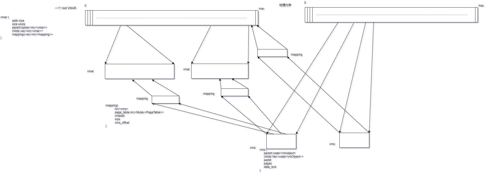

# DailySchedule

## **TOC**

*四月*

| Mon                  | Tues                 | Wed                  | Thur                 | Fri                  | Sat                  | Sun                  |
|----------------------|----------------------|----------------------|----------------------|----------------------|----------------------|----------------------|
|                      |                      | 1                    | 2                    | 3                    | 4                    | 5                    |
| 6                    | 7                    | 8                    | [9](#0)              | 10 <br> ([D1](#1))   | 11 <br> ([D2](#2))   | 12 <br> ([D3](#3))   |
| 13 <br> ([D4](#4))   | 14 <br> ([D5](#5))   | 15 <br> ([D6](#6))   | 16 <br> ([D7](#7))   | 17 <br> ([D8](#8))   | 18 <br> ([D9](#9))   | 19 <br> ([D10](#10)) |
| 20 <br> ([D11](#11)) | 21 <br> ([D12](#12)) | 22 <br> ([D13](#13)) | 23 <br> ([D14](#14)) | 24 <br> ([D15](#15)) | 25 <br> ([D16](#16)) | 26 <br> ([D17](#17)) |
| 27 <br> ([D18](#18)) | 28 <br> ([D19](#19)) | 29 <br> ([D20](#2))  | 30 <br> ([D21](#21)) |                      |                      |                      |

*五月*

| Mon                  | Tues                   | Wed                  | Thur                 | Fri                  | Sat                  | Sun                  |
|----------------------|------------------------|----------------------|----------------------|----------------------|----------------------|----------------------|
|                      |                        |                      |                      | 1  <br> ([D22](#22)) | 2  <br> ([D23](#23)) | 3  <br> ([D24](#24)) |
| 4  <br> ([25](#25))  | 5  <br> ([D26](#26))   | 6  <br> ([D27](#27)) | 7  <br> ([D28](#28)) | 8  <br> ([D29](#29)) | 9  <br> ([D30](#30)) | 10 <br> ([D31](#31)) |
| 11 <br> ([D32](#32)) | 12 <br> ([D33](#33))   | 13 <br> ([D34](#34)) | 14 <br> ([D35](#35)) | 15 <br> ([D36](#36)) | 16 <br> ([D37](#37)) | 17 <br> ([D38](#38)) |
| 18 <br> ([D39](#39)) | 19 ⭐ <br> ([D40](#40)) | 20 <br> ([D41](#41)) | 21 <br> ([D42](#42)) | 22 <br> ([D43](#43)) | 23 <br> ([D44](#44)) | 24 <br> ([D45](#45)) |
| 25 <br> ([D46](#46)) | 26 <br> ([D47](#47))   | 27 <br> ([D48](#48)) | 28 <br> ([D49](#49)) | 29 <br> ([#50](#50)) | 30 <br> ([D51](#51)) | 31 <br> ([D52](#52)) |

 *六月*                

| Mon                  | Tues                   | Wed                  | Thur                 | Fri                  | Sat                   | Sun                  |
|----------------------|------------------------|----------------------|----------------------|----------------------|-----------------------|----------------------|
| 1  <br> ([D53](#53)) | 2  <br> ([D54](#54))   | 3  <br> ([D55](#55)) | 4  <br> ([D56](#56)) | 5  <br> ([D57](#57)) | 6 ⭐ <br> ([D58](#58)) | 7  <br> ([D59](#59)) |
| 8  <br> ([D60](#60)) | 9  <br> ([D61](#61))   | 10 <br> ([D62](#62)) | 11 <br> ([D63](#63)) | 12 <br> ([D64](#64)) | 13 <br> ([D65](#65))  | 14 <br> ([D66](#66)) |
| 15 <br> ([D67](#67)) | 16 ⭐ <br> ([D68](#68)) | 17 <br> ([D69](#69)) | 18 <br> ([D70](#70)) | 19 <br> ([D71](#71)) | 20 <br> ([D72](#72))  | 21 <br> ([D73](#73)) |
| 22 <br> ([D74](#74)) | 23 <br> ([D75](#75))   | 24 <br> ([D76](#76)) | 25 <br> ([D77](#77)) | 26 <br> ([D78](#78)) | 27 <br> ([D79](#79))  | 28 <br> ([D80](#80)) |
| 29 <br> ([D81](#81)) | 30 <br> ([D82](#82))   |                      |                      |                      |                       |                      |

 *七月*                

| Mon                    | Tues                   | Wed                    | Thur                   | Fri                    | Sat                    | Sun                    |
|------------------------|------------------------|------------------------|------------------------|------------------------|------------------------|------------------------|
|                        |                        | 1  <br> ([D83](#83))   | 2  <br> ([D84](#84))   | 3  <br> ([D85](#85))   | 4  <br> ([D86](#86))   | 5  <br> ([D87](#87))   |
| 6  <br> ([D88](#88))   | 7  <br> ([D89](#89))   | 8  <br> ([D90](#90))   | 9  <br> ([D91](#91))   | 10 <br> ([D92](#92))   | 11 <br> ([D93](#93))   | 12 <br> ([D94](#94))   |
| 13 <br> ([D95](#95))   | 14 <br> ([D96](#96))   | 15 <br> ([D97](#97))   | 16 <br> ([D98](#98))   | 17 <br> ([D99](#99))   | 18 <br> ([D100](#100)) | 19 <br> ([D101](#101)) |
| 20 <br> ([D102](#102)) | 21 <br> ([D103](#103)) | 22 <br> ([D104](#104)) | 23 <br> ([D105](#105)) | 24 <br> ([D106](#106)) | 25 <br> ([D107](#107)) | 26 <br> ([D108](#108)) |
| 27 <br> ([D109](#109)) | 28 <br> ([D110](#110)) | 29 <br> ([D111](#111)) | 30 <br> ([D112](#112)) | 31 <br> ([D113](#113)) |                        |                        |

 *八月*                

| Mon                    | Tues                   | Wed                    | Thur                   | Fri                    | Sat                    | Sun                    |
|------------------------|------------------------|------------------------|------------------------|------------------------|------------------------|------------------------|
|                        |                        |                        |                        |                        | 1  <br> ([D114](#114)) | 2  <br> ([D115](#115)) |
| 3  <br> ([D116](#116)) | 4  <br> ([D117](#117)) | 5  <br> ([D118](#118)) | 6  <br> ([D119](#119)) | 7  <br> ([D120](#120)) | 8  <br> ([D121](#121)) | 9  <br> ([D122](#122)) |
| 10 <br> ([D123](#123)) | 11 <br> ([D124](#124)) | 12 <br> ([D125](#125)) | 13 <br> ([D126](#126)) | 14 <br> ([D127](#127)) | 15 <br> ([D128](#128)) | 16 <br> ([D129](#129)) |
| 17 <br> ([D130](#130)) | 18 <br> ([D131](#131)) | 19 <br> ([D132](#132)) | 20 <br> ([D133](#133)) | 21 <br> ([D134](#134)) | 22 <br> ([D135](#135)) | 23 <br> ([D136](#136)) |
| 24 <br> ([D137](#137)) | 25 <br> ([D138](#138)) | 26 <br> ([D139](#139)) | 27 <br> ([D140](#140)) | 28 <br> ([D141](#141)) | 29 <br> ([D142](#142)) | 30 <br> ([D143](#143)) |
| 31 <br> ([D144](#144)) |                        |                        |                      |                        |


<!-- *四月*

| Mon       | Tues      | Wed       | Thur      | Fri       | Sat       | Sun       |
|-----------|-----------|-----------|-----------|-----------|-----------|-----------|
|           |           | 1         | 2         | 3         | 4         | 5         |
| 6         | 7         | 8         | [9](#0)   | [10](#1)  | [11](#2)  | [12](#3)  |
| [13](#4)  | [14](#5)  | [15](#6)  | [16](#7)  | [17](#8)  | [18](#9)  | [19](#10) |
| [20](#11) | [21](#12) | [22](#13) | [23](#14) | [24](#15) | [25](#16) | [26](#17) |
| [27](#18) | [28](#19) | [29](#2)  | [30](#21) |           |           |           | -->


## OLD TOC Day 0~60


* [Day 0](#0)  
* [Day   1    (2020-04-10)](#Day001)   
* [Day   2    (2020-04-11)](#Day002)   
* [Day   3    (2020-04-12)](#Day003)  
* [Day   4    (2020-04-13)](#Day004)  
* [Day   5    (2020-04-14)](#Day005)  
* [Day   6    (2020-04-15)](#Day006)  
* [Day   7    (2020-04-16)](#Day007)  
* [Day   8    (2020-04-17)](#Day008)  
* [Day   9    (2020-04-18)](#Day009)  
* [Day  10    (2020-04-19)](#Day010)  
* [Day  11    (2020-04-20)](#Day011)  
* [Day  12    (2020-04-21)](#Day012)  
* [Day  13    (2020-04-22)](#Day013)  
* [Day  14    (2020-04-23)](#Day014)   
* [Day  15    (2020-04-24)](#Day015)  
* [Day  16    (2020-04-25)](#Day016)  
* [Day  17    (2020-04-26)](#Day017)  
* [Day  18    (2020-04-27)](#Day018)  
* [Day  19    (2020-04-28)](#Day019)  
* [Day  20    (2020-04-29)](#Day020)  
* [Day  21    (2020-04-30)](#Day021)  
* [Day  22    (2020-05-01)](#Day022)  
* [Day  23    (2020-05-02)](#Day023)  
* [Day  24    (2020-05-03)](#Day024)  
* [Day  25    (2020-05-04)](#Day025)
* [Day  26    (2020-05-05)](#Day026)
* [Day  27    (2020-05-06)](#Day027)  
* [Day  28    (2020-05-07)](#Day028)  
* [Day  29    (2020-05-08)](#Day029)  
* [Day  30    (2020-05-09)](#Day030)  
* [Day  31    (2020-05-10)](#Day031) 
* [Day  32    (2020-05-11)](#Day032) 
* [Day  33    (2020-05-12)](#Day033) 
* [Day  34    (2020-05-13)](#Day034) 
* [Day  35    (2020-05-14)](#Day035) 
* [Day  36    (2020-05-15)](#Day036) 
* [Day  37    (2020-05-16)](#Day037)  
* [Day  38    (2020-05-17)](#Day038)  
* [Day  39    (2020-05-18)](#Day039)  
* [Day  40    (2020-05-19)](#Day040)⭐  
* [Day  41    (2020-05-20)](#Day041)  
* [Day  42    (2020-05-21)](#Day042)  
* [Day  43    (2020-05-22)](#Day043)  
* [Day  44    (2020-05-23)](#Day044)  
* [Day  45    (2020-05-24)](#Day045)  
* [Day  46    (2020-05-25)](#Day046)  
* [Day  47    (2020-05-26)](#Day047)  
* [Day  48    (2020-05-27)](#Day048)  
* [Day  49    (2020-05-28)](#Day049)  
* [Day  50    (2020-05-29)](#Day050)  
* [Day  51    (2020-05-30)](#Day051)  
* [Day  52    (2020-05-31)](#Day052)  
* [Day  53    (2020-06-01)](#Day053)  
* [Day  54    (2020-06-02)](#Day054)
* [Day  55    (2020-06-03)](#Day055)
* [Day  56    (2020-06-04)](#Day056)
* [Day  57    (2020-06-05)](#Day057)
* [Day  58    (2020-06-06)](#Day058)⭐
* [Day  59    (2020-06-07)](#Day059)
* [Day  60    (2020-06-08)](#Day060)

<span id="0"></span>
## Day 0

### 事件1： 沟通获取项目信息

信息内容：  
hypervisor方向，目的是准备在rcore上实现一个简单的type2的hypervisor，参考的是zcore中的实现  
https://github.com/PanQL/zircon/blob/master/docs/syscalls.md#hypervisor-guests  

syscall方向，目的是补全syscall，让fuchsia的用户态应用在上面启动，具体的参考zCore那个仓库里面的wiki和代码  
https://github.com/rcore-os/zCore/wiki/Status:-Syscalls   

### 事件2：浏览文档

经过查看，第一个文档是Zircon System Calls的详细说明、第二个文档是zcore待补全的syscall的列表  

### 问题：

尚不清楚、实现hypervisor和补全syscall的具体思路与做法、

### 预计计划：  

1、再次沟通了解实现思路与具体做法、所需背景知识、  
2、开发环境搭建与准备、  
3、沟通了解zcore整体结构、  

<span id="Day001"></span>
## Day 1 （2020-04-10）


### 事件1： 沟通hypervisor实现流程

沟通后、因为对这方面没有太多知识储备支撑、建议先参考https://www.cs.unc.edu/~porter/courses/comp790/s17/labs.html 一个小型的hypervisor构建过程进行理解学习、

### 事件2: 科学上网、浏览Fuchsia文档结构

根据理解、在zcore上补全syscall的工作、似乎是参照zircon进行的、所以需要理解zircon的内容和运作、

### 事件3：看unc实验指导、试图理解在实现hypervisors的流程

#### 理解：

在一个正常运行的操作系统上、试图开启虚拟化、是由一个在用户态下的程序启动的、这个程序通过调用syscall、来实现在电脑上的分配空间、装载新的操作系统、这个系统通称叫guest、

##### 简要实现流程：  

Step1：实现对CPU支持vmx和扩展分页的检测，了解如何发现CPU是否支持vmx和扩展分页、用以知道是否可虚拟化、  

Step2：通过syscall创建guest、然后把guest的bootloder和kernel复制到guest的物理地址空间中  

Step3：实现vmlaunch和vmresume、用以来启动VM、  

Step4：这时guest可以成功进入运行、但还不可以处理中断、要添加guest的处理中断功能、叫做VM exits、与发出系统调用（例如，使用 int 或 syscall 指令）类似，guest可以使用 vmcall 指令（有时称为hypercalls）以编程方式捕获到host  

Step5：在VM中仅使用vmcall来请求“伪”内存映射、完成实现handle_cpuid  

Step6：当执行I/O时也应补充上I/O的vmcall

这样大概就有一个简单和能跑的hypervisor、以上内容仅有读实验指导书得出的大概理解、没有对代码由过多深入理解、感觉理解程度仅有20%、

### 问题

1、知道hypervisor大致流程后、对代码目前还毫无头绪、同时对于zircon的hypervisor的实现不清楚、  
2、今天时间不够、没能具体的看zircon内容、对zircon还是模糊的    

### 计划

1、通过今天的理解、明天进行一次沟通、印证流程正确与否、  
2、尝试找到zircon的对应部分、去查看代码实现、是否也是这个流程、  
3、进一步阅读zircon的官方文档、  


<span id="Day002"></span>
## Day 2 （2020-04-11）

由于周末觉得叨扰别人不适合、计划调整为补充背景知识

### 事件1：通过aos视频再次理解学习Hypervisor

经过这两天的整理的信息、再次看一遍视频、有了一些新的理解、对hypervisor概念和做法有了初步认识、 

### 事件2：查看zircon的文档、

通过科学上网进入 https://fuchsia.dev/fuchsia-src/concepts/kernel 阅读文档、试图理解zircon都说的什么、怎么组成的、结构是什么样的、发现很多概念不清楚、有很多东西不知道作用、需要反复阅读与查阅资料补充、目前还没有系统的认识、

### 问题

1、无法很快的理解zircon、准备持续一小段时间看看结果、  
2、因为还没摸清zircon的结构、也没能很好的找到zircon实现hypervisor部分代码逻辑、  

### 计划

1、继续在学下zircon的文档、搞清楚个大概、理解下怎么运行、  
2、准备周一在沟通交流下、   

<span id="Day003"></span>
## Day 3 （2020-04-12）

Errr..今天处理了一些杂事、没能正经营业、接下来要抓紧时间了、  

<span id="Day004"></span>
## Day 4 （2020-04-13）周一

### 事件1：继续学习hypervisor

再次参考https://www.cs.unc.edu/~porter/courses/comp790/s17/labs.html 一个小型的hypervisor构建过程、结合代码理解hypervisor、并制作一个简单流程图帮助理解、  


理解vmcs的作用及需要设置的大概内容、艰难阅读intel手册、效率不够理想、对此感到沮丧、

### 事件2：继续学习理解zircon

阅读了关于zircon、kernel部分的概念、对zircon大概有了一个认知、并确认了体量很大、还有对很多内容理解不到位、认为这个方法不有效、决定找rj取取经、加快对zircon的学习、


### 问题

1、对hypervisor大体认识有了、细节不够、包括很多intel手册内容、也不清楚、   
2、又看了zircon的结构、还是不能清晰代码逻辑、知道中间缺着一些内容、但具体什么不清楚、需要一点一点查、  

### 计划

1、找rj交流下zircon的内容、  
2、在对zircon有了一定认识后在去交流hypervisor、syscall、  


<span id="Day005"></span>
## Day 5 （2020-04-14）周二

### 评估后新短期计划

预计时间: 两个星期  

预计内容: 
```
   1、Blog OS 
   2、rCore_tutorial
   3、hypervisor lab
   4、zcore 
```
时间分配:  
1、重新理解熟悉Blog os内容 （3天）  
2、重新理解掌握rcore_tutorial内容 （4天）  
3、理解尝试完成hypervisor lab（3天）  
4、run起zcore、并理解项目 （4天）  

预计十四天左右、上下浮动不应超过太多、要求保质保量、稳步进行、


### 事件1：深入理解学习 Blog OS

再一次看Blog OS 虽然今天没有代码操作、但对最基本的一些概念和理解感觉认识的更清晰了、第一次学的时候没那么清晰的概念、或没有注意的地方、这次比较容易的就理解了。

今天的进度是：  
1、A Freestanding Rust Binary  
2、A Minimal Rust Kernel  
5、CPU Exceptions  
6、Double Faults  
7、Hardware Interrupts  

### Funny thing ★

看Blog OS时发现出了中文版、我也去看看了中文版、很巧的找到了一个命令错误、我看comment没有人进行评论、我以为没什么人在意这个中文版、就用中文写了个comment、没想到作者真的很勤快、没多久就回复了、😂、但他说看不懂中文、并@了中文翻译的贡献者、然后改了、算是一件比较有趣的事情、😂😂😂、

### 计划 

明天看MEMORY MANAGEMENT章节


<span id="Day006"></span>
## Day 6 （2020-04-15）周三

### 事件1：复习Rust

通过看群里分享的连接、看了看Rust和C++的各方面的相似与不同、对于Rust的lifetime、变量传递、又有了一些新认识、ownership就是对资源使用有序化的规定机制、不再像c++里那么自由随意、减少了很多出意外的机会、同时也获得了相对高一些的学习成本、这种取舍看起来是非常不错的决定、尽量解决源头问题、感受到一些语言设计灵光、


### 事件2：Blog OS MEMORY MANAGEMENT章节

内存管理的机制、感觉既普通又高级、因为脱离内存、可以是对空间管理的通用设计、也适用的上很多生活实际的东西、要多深入理解理解、看了慢了些、还没看完、

### 计划 

计划对Blog OS 有一个整理、进行收尾、在把aos课程的学习添加到计划上、之前大意忽略掉了、


明天看MEMORY MANAGEMENT章节


<span id="Day007"></span>
## Day 7 （2020-04-16）周四

### 事件1：Blog OS 内存管理

今天在看内存映射的时候卡住了、感觉有点绕、理解不太透彻、耗费了许久、感觉是因为bootloader被封装、细节看不全、今天结束之前至少要完成这部分内容、  

虽然时间使用的多了些、但也要十分深入的理解这个运行细节、在哪里都避不开、就像之前看到vmm里的ept、依然还是要跟这部分内容打交道、要学习牢固且透彻、   

### 问题

在一件事情上超出了预计时间、造成了一些延期、

### 计划 

按计划再去看rCore_tutorial、有重叠的部分、可以互相印证、


<span id="Day008"></span>
## Day 8 （2020-04-17）周五

今天做的事情有些杂乱、转乘过度

### 事件1：Blog OS 结束

看完了blog os 对目前文章里的所介绍的知识、都有了基本的知识背景与理解、缺少一些实践与应用、要对比rcore_tutorial印证、

### 事件2：学习rcore_tutorial

发现在blog os里没注意到的点、对bootloader这个很有大知识盲区、对kernel之前这块链接、汇编很模糊、猜测因为对编译原理知识背景的空白导致的、一直不能很整体的知道这些做了什么、在这了花了一些时间试图搞明白、但结果没想象中的那么有效、

### 事件3：准备了一下开发环境

因为一些电脑原因、之前的环境不能用了、又准备下环境、这件事件确实糟心、

### 事件4：看了西部数据的Xvisor的ppt

因为看了blog os又看到rcore_tutorial、一个x86_64、一个riscv、便对rsicv怎么做hypervisor产生疑问、找到了西部数据介绍这个的ppt、看了以后有了大概了解、看到最后两页、反应过来这不是aos最后riscv那张图么、😂感到幸运的碰巧、  

之前也跟rj交流过type1的看法、并觉得做type1在不考虑包袱的情况下是理论正确的、riscv对这个方面设计好像支持不错、

### 问题

编译原理没有整体的概念、对汇编、编译、链接理解不到位、对经常使用的一些底层工具什么llvm等感到陌生、

### 计划 

完成一下rcore_tutorial、包括代码部分、同时整理考虑、应该如何在这之上添加hypervisor、需要什么、


<span id="Day009"></span>
## Day 9 （2020-04-18）周六

又是心情复杂的一天

### 事件1：网上找编译原理概述学习

学习了一下、编译原理的概述、是通过什么方式做什么内容、在什么范围内、结构大致为什么样子、每一步都要干一件什么事情、很皮毛的有了一个大致的了解、

### 事件2：梳理清楚编译、链接这部分内容 

对链接这部分有了大体的理解、对编写链接脚本、知道有何作用、为了定义内存的布局、和数据的摆放、  
顺便同时也明白了kernel入口设置的那段汇编的作用、查了一些汇编指令与伪指令的具体含义、  

### 事件3：为unc实验做准备、加入了课的GitHub classroom

在看rcore_tutorial同时想知道什么条件下可以做hypervisor、需要完成什么模块是完备的、去看了unc的实验指导、需要在GitHub上加入这学期课的组织、设置了一个自己的私有仓库、可供管理

### 事件4：这是一个悲剧

对、没错、又是电脑出了问题、感觉绝望、因为历史原因、电脑容量只有120G、系统盘只有40G、windows本身就占了很多又将近20多G、因为wsl和docker的原因、系统盘已经没有空间了、我尽己所能删除所有东西、压缩到极限、但是依旧满足不了、开发环境的配置空间、  

感觉走头无路、进退两难、新作系统、会丢失很多环境配置、不做盘符也没位置了、电脑机箱有问题又没空间无法扩容、真是一个悲剧、  

需要冷静一下、
  
### 问题

电脑一团糟、就像这复杂的心情、

### 计划 

想明天放空大脑一天、被电脑搞到濒临崩溃、😩、心情难以言喻、  

反复的得出结论：工欲善其事、必先利其器、~工欲善其事、必先利其器、~工欲善其事、必先利其器、


<span id="Day010"></span>
## Day 10 （2020-04-19）周日

### 事件1：佛系修补电脑

拆东墙补西墙、暂时能用了、

### 事件2：配置jos环境、make失败

卡在make上、视警告为错误、可是我已有设置flag忽略了、还是没能通过、

### 事件3：杂七杂八的看了点东西

配置环境时、被卡住很迷茫、杂七杂八的看了一些东西、


<span id="Day011"></span>
## Day 11 （2020-04-20）周一

### 事件1：学习aos课程

仔细的听了VMM优化的那一节课、之前有听过一次、不明所以、这次再去听了一次、感到接受了很多信息、

### 事件2: rcore_tutorial

边做边看、因为环境问题、跑到实验楼上去做实验、就是不好保存、很不方便、

### 事件3：对比jos

同时对比jos代码、找到各自不同的设计思路、目前还没完成、
 
### 计划 

结束rcore和jos这部分后、有了一定理解、去与他人交流一下、


<span id="Day012"></span>
## Day 12 （2020-04-21）周二

### renew新的重点

开会后听取老师建议、既然已经学习了blog os的话、就应学的透彻一些、进行一些转化和产出、  
比如是否可以形成关键知识点的总结、基于blog os 的代码改动、等等、要理解到位

### 事件1：学习aos课程

Interface Design有了基本了解、听后有很多想法、优秀的interface设计、体现着对整体事物的把握与理解的程度、并且接口的设计、语义的定义是一个动态的过程、拥有时间范围和有效期、会随则时代发展而适应当时的最优解、如何设计易用、高效、解耦、可扩展的接口确实是个很有意思的事情、
 
 
### 事件2：贼心不死的又去试图搞环境

### 事件3：好奇结构代码结构

因为了解下blog os、zcore和jos、发现一个monolithic、一个micro、一个exo、仔细又去了解了区别、  
觉得综合理清下他们的代码结构、看看实际实现上区别在哪里不同、  

### 计划 

先把blog os理清、理解、因为代码量最小、最快、然后jos、次之、最后zcore、


<span id="Day013"></span>
## Day 13 （2020-04-22）周三

### 事件1：看了一点aos的课

把昨天看了、但不是很清晰的章节又回看了下、

### 事件2：阅读blog os代码

虽然运行不了、但是对着博客看仔细阅读理解代码、


<span id="Day014"></span>
## Day 14 （2020-04-23）周四

### 事件1：阅读blog os代码

Exceptions 部分、看了x86_64的实现、理解底层逻辑、动手实现了下、跑了起来、


<span id="Day015"></span>
## Day 15 （2020-04-24）周五

### 事件1：获得电脑

内心激动、然而在下载好镜像时、发现找不到很久没用的u盘了、备受打击、又去买了个u盘、明天才能到、

### 事件2：阅读blog os代码

还是Exceptions 部分、每一次从新去看去做、总是会发现原先有些遗漏的点、原先没思考到的问题、越来越细节、   
浏览了bootloader、和bootimage源码、试图理解是怎么启动的、没找又.ld代码逻辑万千没理清、但是在bootloader里又几个汇编、写得比较详细、   
有探测内存的e820.s、不知道怎么转入的_start、但_start有三个阶段、   
每段汇编都大概了解干什么了、没找理清调用顺序、找着找着就断了、不明白、    
中断这一块、大致弄清了、CPU做了什么、什么流程跑起来的、x86_64定义了什么结构、kernel里设置那些中断的道理、差不多都可以很清楚的表述了、觉得可以达到与人交流的地步了、可惜没什么谈话机会、  


<span id="Day016"></span>
## Day 16 （2020-04-25）周六

### 事件1：安装电脑

u盘到了、安装电脑、一遍又一遍、、

### 事件2：impl blog os代码

感觉自己精通了 环境安装 这个步骤、对qemu、认识大增、[不知该开心还是悲伤]、

<span id="Day017"></span>
## Day 17 （2020-04-26）周日

处理了些杂事......

### 事件1：好久没用linux、熟悉操作

就也不知到干了什么有效的工作、但确实搞了很多操作..


<span id="Day018"></span>
## Day 18 （2020-04-27）周一

### 事件1：结束 反复了好几次的blog_os 中断部分实现

这部分内容不算多、难度也不大、第一次就以为差不多理解了、但就是因为各种情况把、反反复复搞了很久（包括前面装qemu、各种工具）、虽不知道多学会了什么、但感觉掌握的更牢固了、理解也全面了、

### 事件2：blog_os memory实现部分开启

之前重点在于理解内存管理这部分概念、机制方面的东西、虽说之前也学过一些、得到中断那部分经验、要反复去做、

### 事件3:听完周六的会、又去看了下blog_os Async/Await部分


<span id="Day019"></span>
## Day 19 （2020-04-28）周二

### 事件1：um..不知为何、操作过频繁时会死机、

遇到几次死机、不知道是那里的问题、电脑还是新系统、搞得system setting 也打不开了、也无法关机和重启了、排查了一会、um..觉得我还是老老实实的继续写一写code好了、别在环境没了、得不偿失、小心使用、

### 事件2：blog_os memory实现

再次一点点的仔细去看和实现、


<span id="Day020"></span>
## Day 20 （2020-04-29）周三

### 事件1：Memory 精简完整过程

内存：   
（一/三）、bootloader ：   

            1、执行 内存 的 探测 、保存 结构 信息 传入 OS    
            2、布局 映射 写入 内存、格式为Page Table Entry ，保存一个起始地址进CR3、我们设计的页表机制准备工作完成    
                
（二/三）、OS： 为了、管理空间、负责记录各个数据在那里、需要记录在页表里、 

            1、必要有 把 虚拟空间和物理空间进行映射   
            2、必要有 翻译、即虚拟地址翻译成为物理地址  
            3、因为要记录 必须在 现实中 有地方存储 、把从bootloader传入的内存结构、管理起来、实现物理页帧分配  

（三/三）、OS： 因为栈的机制、使我们使用数据非常不灵活、所以开辟了堆区、 

            1、设置堆区基本信息  
            2、设置堆区分配算法与机制  


<span id="Day021"></span>
## Day 21 （2020-04-30）周四

### 事件1：Async/Await

Future、运行机制、就像他的名字一样、“期货” 、在未来的某一时刻将会到来、但在这段时间不会妨碍当前的动作、...


<span id="Day022"></span>
## Day 22 （2020-05-01）周五

### 事件1：尝试在blog os 上开启虚拟化

查看了解 intel 手册 、调查背景、理解生态，尝试cpuid、结果在意料之外、不支持虚拟化、um...  


<span id="Day023"></span>
## Day 23 （2020-05-02）周六

### 事件1：code 完成 Blog OS

run done  
但是还要继续搞清楚很多问题、  


<span id="Day024"></span>
## Day 24 （2020-05-03）周日

计划表

|   HW   |                                Descript                                              |  Difficulty  |  Priority  |
|  ----  |                                --------                                              |  ----------  |  --------  |
|   01   |  不用Target Specification可不可以进行、怎么进行？                                         |      ★★      |    ★★      |
|   02   |  理解串口、1、使用串口 输出 hello ；2、使用串口 输入 hello                                  |     ★★★★★    |    ★★★★    |
|   03   |  理解bootloader 、1、使用自己写的bootloader加载blog os、（汇编、C、Rust都可以，可以参考xv6）  |     ★★★★★    |    ★★★★    |
|   04   |  在IDT初始化时、打印出当前系统状态、比如、当前处于什么模式、异常处理函数地址、页表情况诸如此类      |      ★★      |     ★★     |
|   05   |  理解内存布局情况、包括不限于初始化时内存的物理内存布局、虚拟内存布局、各个时期的内存变化           |      ★★      |     ★★     |
|   06   |  清晰描述包括且不限于linked list分配算法                                                  |      ★★      |     ★★     |
|   07   |  写一些系统调用、分别使用、同步方式 1、C & Rust、2、异步方式 Rust                            |      ★★★     |    ★★★★★   |

除了以上目标明确的homework、还须应有 看书、看资料、看博客、之类的的背景知识补充穿插其中  

尚未排出全部先后顺序和时间表、但觉得第一个选择 HW07、参考一些博客、把这一部分落实下来、清楚理解  

### 事件1：完成HW07 C部分 

使用C写了 open read write close 这些的例子、原来是系统自带的lib、封装的syscall  

知道了这些东西相互之间的关系、学会看man手册

rust 部分 需要std 这好像就不是libc了、卡在对future掌握不全面没有直接动手、


<span id="Day025"></span>
## Day 25 （2020-05-04）周一

### 事件1：继续future的内容理解

可能状态不太对、想切换了任务换一下脑子 试图进入 HW02

### 事件2：HW 02 & 03

我想看串口 、尝试做一下、查询半天资料、包括Qemu的串口功能、串口的一些设置和规定、大致的介绍、知道一些内容后要去做、发现需要启动一个Qemu、那么我需要一个最简单的OS去启动、那么我需要个OS、那么我需要加载这个os、那么我需要个bootloader、突然理解这HW02、03是一起的、又去学习bootloader、makefile

<span id="Day026"></span>
## Day 26 （2020-05-05）周二


### 事件1： HW01

感觉自己有些迟钝、今天发现这些HW环环相扣、今天完成HW01、并总结了一个小文档、过程中知道了、HW01是第一步、昨天看了半天bootloader、也没能动手原因在于不清楚编译器、发现HW01才是开始、现在串起来了、因为有了HW01、才能HW03、完成HW03、要清楚理解HW04、05、最后启动起来、完成HW02、为自己的无知感到惭愧、

### 事件2： Futures 还在进行、

我一开始想得比较天真了、这个背后还是有一定量的背景知识要补充、要不对这个理解不到位、目前follow 200行futures、预计完成后可以正常完成HW07 Rust async部分、

<span id="Day027"></span>
## Day 27 （2020-05-06）周三


### 事件1： 完成Future open read write

完成 HW07、代码仅仅简单的几行、学要清除一个流程后知道每一步功能写出、背景调查用了很旧、

<span id="Day028"></span>
## Day 28 （2020-05-07）周四

### 事件1： 理清x86_64启动流程

查网页、看网页、

### 事件2： 着手bootloader实现

参考 xv6、jos、crate：bootloader、xv6_x86-64、rcore（当然这个没有被参考成功、这是uefi的、我本也想做个uefi、不过之后跟rj沟通了一下、可能预计有10天左右的工作量、跟目前ddl冲突了、就选择了bios）

不过今天什么也没做出来、全在遇到莫名的问题

<span id="Day029"></span>
## Day 29 （2020-05-08）周五

### 事件1： Bootloader 

时间用的很多、也不知道用哪里了、比如怎么在rust结构下编译汇编、要查一会、要试一会、怎么形成elf、什么是elf、内核镜像是怎么生成的、等等一系列愚蠢的问题...

跟rj沟通了一小时、理清思路、

<span id="Day030"></span>
## Day 30 （2020-05-09）周六

### 事件1： 还是bootloader

本以为昨天就完成了、还是被卡住了、一直在试错、也还都不是什么大问题、比如什么objcopy 参数设置阿、link flie书写阿、被编辑器莫名缓存不正确的信息阿、等等一些吧、um... 逐渐在ddl来临之前高压下、进入疯狂..

<span id="Day031"></span>
## Day 31 （2020-05-10）周日


### 事件1： 完成bootloader ？

差不多完成了bootloader的大体内容、还没测试、还有一个小问题需要解决、但都在可预见范围内了、已经没有逻辑上不确定的不能认知的事情了、


|   HW   |                                Descript                                              |  Difficulty  |  Priority  |  Finish  |
|  ----  |                                --------                                              |  ----------  |  --------  |  ------  |
|   01   |  不用Target Specification可不可以进行、怎么进行？                                         |      ★★      |    ★★      |yes|
|   02   |  理解串口、1、使用串口 输出 hello ；2、使用串口 输入 hello                                  |     ★★★★★    |    ★★★★    |not perfect but do|
|   03   |  理解bootloader 、1、使用自己写的bootloader加载blog os、（汇编、C、Rust都可以，可以参考xv6）  |     ★★★★★    |    ★★★★    |yes but not perfect|
|   04   |  在IDT初始化时、打印出当前系统状态、比如、当前处于什么模式、异常处理函数地址、页表情况诸如此类      |      ★★      |     ★★     |yse|
|   05   |  理解内存布局情况、包括不限于初始化时内存的物理内存布局、虚拟内存布局、各个时期的内存变化           |      ★★      |     ★★     |yse|
|   06   |  清晰描述包括且不限于linked list分配算法                                                  |      ★★      |     ★★     |not yet|
|   07   |  写一些系统调用、分别使用、同步方式 1、C & Rust、2、异步方式 Rust                            |      ★★★     |    ★★★★★   |yes but not perfect|


<span id="Day032"></span>
## Day 32 （2020-05-11）周一

### 事件1：看Async-std完、并写async简单应用

尝试用 async 写了函数、调用后  
并测试、发现确实符合 异步描述

### 事件2:办理网络

为了网络畅通、在远程时不会卡顿、等时、更新了网络带宽

### 事件3:补充完成bootloader

创建一个最简单的kernel 、把boot和kernel文件 dd 到一个img里进行测试、没成功

<span id="Day033"></span>
## Day 33 （2020-05-12）周二

### 事件1:排查bootloader问题

使用gdb debug 查看汇编打印变量找问题、未果

<span id="Day034"></span>
## Day 34 （2020-05-13）周三

### 事件1：感觉进入歧途、

gdb打印的指针变量总是不对、去仔细阅读rust语言关于指针的使用、去看C的指针使用

跟rj沟通试图在源码加入打印、编译通过、但不执行打印相关语句、

试图在找新方法尝试

<span id="Day035"></span>
## Day 35 （2020-05-14）周四

### 事件1：重新在流程上进行整理、使用makefile

一开始使用简单的手动命令、改来该去、逐渐复杂、加入makefile

在回顾是不是文件放在一起时的流程哪里除了问题、

关键现在是gdb无法调试、寻找问题难度加大、

四下查找、看到multiboot 规范、是不是我写的不够规范、不能加载、尝试参考下multiboot


<span id="Day036"></span>
## Day 36 （2020-05-15）周五

### 事件1:在rust-playground上复线代码、

在rust playground 上 复线代码 是可以运行的、跑到bootloader里就不太正确、匪夷所思

最后的挣扎、用了各种办法、失败告终


<span id="Day037"></span>
## Day 37 （2020-05-16）周六

### 事件1:上传bootloader仓库

https://github.com/GCYYfun/simple_bootloader 写了文档

### 事件1:bootloader遇阻、调剂到zcore

把zcore下载、查询相关信息


<span id="Day038"></span>
## Day 38 （2020-05-17）周日

### 事件1：阅读cargo reference

cargo 使用相关知识 关于build.rs、等一些配置

### 事件2：bootloader

独立写了 一篇 bootloder 放在同仓库 bootloader.md中


<span id="Day039"></span>
## Day 39 （2020-05-18）周一

### 事件1：查漏补缺 bootloader

把一些细节又去查看了些、还是有些细节的地方看不太懂、但不影响整体理解

### 事件2：为展示作准备

整理了新的文档 、simple bootloader 库里

<span id="Day040"></span>
## Day 40 （2020-05-19）周二
> chyyuu

今天开始进行zcore的linux syscall支持的探索

准备步骤如下：
1. 下载 rcore https://github.com/rcore-os/rCore   zcore https://github.com/rcore-os/zCore
1. 编译运行rcore, zcore
1. 下载alpline linux，在虚拟机(kvm, virtualbox,...之一)中安装alpine linux，在alpine linux中编译生成musl libc的testcase (musl-libc 测例：http://nsz.repo.hu/git/?p=libc-test )，做为syscall测试用例
1. rcore目前已经支持不少libc-test中的测试用例，尝试从简单到复杂把rcore的syscall支持移到zcore中。

注意事项：
1. 在zcore的开发中，注意首先基于用户态模式的zcore进行开发，这样避免开发难度。
1. 进一步学习 https://os20-rcore-tutorial.github.io/rCore-Tutorial-deploy/ 
1. 有问题直接在rcore2020微信群中提问，请其他同学帮忙。
1. https://github.com/EatenBagpipe/rCore  这组同学在rcore上做了一些linux syscall的支持，并用musl libc的testcase 进行测试。你可以做为zcore上linux syscall支持的参考。


> GCYYfun

有些工作之外的情况、造成一些进度延迟、明天弥补

1. 下载 rcore https://github.com/rcore-os/rCore   zcore https://github.com/rcore-os/zCore   |完成
1. 编译运行rcore，zcore |完成   (遇到的问题 放在zcore syscall detail 里)
1. 下载 alpline linux 虚拟机 跑起来 |完成

### 事件1：查看 rcore zcore 项目 

把一些 名词 查看是干什么的、梳理结构、下载、准备东西

### 事件2：处理了一些杂事

<span id="Day041"></span>
## Day 41 （2020-05-20）周三

> GCYYfun

1. 编译 musl libc test-case      |完成
1. 移植 rcore syscall 到zcore    |未完成

### 事件0:继续昨天的一些东西

### 事件1:编译 musl-libc test case

通过编译、结果测试全是fail、um...不知道对不对

### 事件2: 学习 rCore 新文档

第零章  
https://os20-rcore-tutorial.github.io/rCore-Tutorial-deploy/ 

在 __使用QEMU运行__ 一节、 使用 #![feature(asm)] 而程序使用 llvm_asm!  
按程序为准、应改为 #![feature(llvm_asm)]


<span id="Day042"></span>
## Day 42 （2020-05-21）周四

> GCYYfun

um...没有什么实质的进展、还在弄清情况、琐碎的一天

<span id="Day043"></span>
## Day 43 （2020-05-22）周五

> GCYYfun

梳理流程、熟悉项目代码、大致有了下一步的方向、需要熟悉rcore代码、准备把rcore的教程在过一遍、熟悉了结构、和流程、好快速上手、


<span id="Day044"></span>
## Day 44 （2020-05-23）周六

> GCYYfun

### 事件1: 做rcore教程


### 事件2：弄明白rcore 上跑 lib-test

流程： 

1. 为了移植rcore syscall 到 zcore 上、应该 正常能运行 rcore 是上syscall

2. 为了能知道rcore 上 syscall 是否 能正确运行、应该有对应测试

3. 为了有对应测试、应该把musl 的libc-test放到rcore里运行、

4. 为了能使libc-test在rcore里运行、我们应该能把这个东西打包放入rcore

5. 为了打包放入rcore，应该 先把 libc-test编译、因为c文件无法直接运行

6. 为了编译libc-test，因该需要 musl环境、所以下了virtual box、安装了alpine

所以说原来这件事是这么个意思、  

我需要下一个 __libc-test__  、并且在musl环境下 __编译__ 、生成的东西、需要 __打包进入rcore__ 、然后在rcore里 __执行__ 编译出来的东西、就能测rcore 的syscall情况、对应补充syscall、然后在porting到zcore.

原来如此.....才明白

那么  
1. 需要 会 从 vbox 、导出编译好的文件 、节省再去本机配置一个musl环境
2. 需要 会 rcore 的打包、makefile的详情流程、
3. 需要 会 运行 libc-test 测试、
4. 需要 会 看结果

要了解 项目 libc-test  
要了解 项目 rcore

<span id="Day045"></span>
## Day 45 （2020-05-24）周日

> GCYYfun

### 事件1: rcore里运行 test-case

结果 不理想 需要分别去 看下问题

图例：  


### 事件2: 了解下 test-case这个程序

还没有 清晰结果


<span id="Day046"></span>
## Day 46 （2020-05-25）周一


### 事件1: 作了一些 rustlings

可惜刚开始学rust时、没能仔细学会些rust book

每次翻看都觉得可惜

### 事件2: 沟通 syscall 

运行 流程的 具体细节之类、最后环境还有有一些问题


<span id="Day047"></span>
## Day 47 （2020-05-26）周二

> GCYYfun

### 事件1: 思考了几个问题？？

提了几个 issues 

https://github.com/GCYYfun/DailySchedule/issues/2

https://github.com/GCYYfun/DailySchedule/issues/3


之后还有待解决

### 事件2: 拯救环境

半死不活 需要重做系统 

### 事件3: 测 libc-test 

结果在文档 libc-test case result

https://github.com/GCYYfun/DailySchedule/tree/master/libc-test%20case/rCore/README.md


> chyyuu 有进步。需要多总结，多思考，多系统地学习。


<span id="Day048"></span>
## Day 48 （2020-05-27）周三

### 事情1:作了一个测例

制作 过程中 遍历了 测例的 名字 

同时 浏览了 libc-test 的 目录结构

还没 开始 尝试、 因为 要下系统

### 事件2:整理 文档 、

准备 重做系统

### 事件3:构思 auto test

https://github.com/GCYYfun/DailySchedule/blob/master/doc/auto-test.md


<span id="Day049"></span>
## Day 49 （2020-05-28）周四

> GCYYfun 

### 事件1:尝试 git 一些 命令 了解 分支 

看文档 https://git-scm.com/book/en/v2 深入 理解 分支 部分 

### 事件2：继续 学习 qemu 的 使用

看文档 https://www.qemu.org/docs/master/system/index.html  学习 一些 参数 、命令所起到了 功能、

### 总结 

还是要多读书、好好看、好好学、书上的的东西 真有用、😂


<span id="Day050"></span>
## Day 50 （2020-05-29）周五

> GCYYfun 

### 事件1: qemu的具体探索

对qemu的探索 写了 一个 文档 

https://github.com/GCYYfun/DailySchedule/blob/master/doc/qemu.md

目前 发现 有些 方法 不太适合

### 事件2：写了 一个小脚本 

剥离了 一些 命令 运行起来了 内核、 但是 传参 和 共享文件 遇到问题、在赵办法解决 


<span id="Day051"></span>
## Day 51 （2020-05-30）周六

> GCYYfun 

### 事件1: 重做系统 

心情舒畅！

### 事件2：使用 docker 运行 qemu  

通过 测试 ：  

如果以rCore为 基准OS

找不到 __传参__ 和 __共享文件__ 的好办法 

1. Plan9 需要 os 对这个协议的支持 在 os 里通过 mount 挂载

2. 通过 ssh 同样也需要 os 的支持 才能使主机 连接

3. 挂载 一个镜像 只能传输 到 qemu里无法取出 文件

4. -kernel 需要 bootloader 和 kernel 打包成 一个 img  目前 rcore是 uefi启动  boot 和 kernel 分离

### 事件3： 看系统编程手册

第1-5页

### 总结 

需要去沟通一下了、


<span id="Day052"></span>
## Day 52 （2020-05-31）周日

> GCYYfun 

### 事件1: 交互 问题 解决 

哈哈 、早上 吃饭 换了一个思路 、想用python 代替 交互 、每没想到 shell 也有 就 省事 用了 一个 expect 的 库

apt install expect 

就安装好了 、真方便

解决了、host 和 guest 的指令 交互 问题

### 事件2：好像真的无法简单的从qemu里取出文件

尝试 openssh 安装在 rcore里 具有 传输功能、但是 可能是缺少syscall 的支持 、无法简单达成


<span id="Day053"></span>
## Day 53 （2020-06-01）周一

> GCYYfun 

### 事件1: 构建 auto-test 流程

制作一个仓库 

https://github.com/GCYYfun/auto_test

有一个 完整的 经验证的环境docker

地址:um...
```
own@Realm:~$ docker images
REPOSITORY          TAG                 IMAGE ID            CREATED             SIZE
gcyy/ubuntu20.04    latest              c625c127c3e1        2 minutes ago       8.32GB
ubuntu              latest              1d622ef86b13        5 weeks ago         73.9MB
```
感觉 不太行 这也太大了

>chyyuu 你把rcore/zcore想的功能太强了。建议与工程师聊聊。
>GCYYfun :好的、好的、一不注意就陷进去了


<span id="Day054"></span>
## Day 54 （2020-06-02）周二

> GCYYfun 

### 事件1: 完善 auto-test 仓库

可以 进行 自动测试了 、还没写文档、马上写

配置好了 环境、不会因为 环境不同 而 无法运行了

还没 有完全、但初步 算好了、继续继续扩展

https://github.com/GCYYfun/auto_test

这个库、多发几天、提高曝光度🦐！

### 总结

配置环境令人 头秃 （已秃..


<span id="Day055"></span>
## Day 55 （2020-06-03）周三

> GCYYfun

### 事件1: 对libctest 作测试 支持

整理 、完善 仓库 文档、

基本可运行、预计明天完成

https://github.com/GCYYfun/auto_test

<span id="Day056"></span>
## Day 56 （2020-06-04）周四

> GCYYfun

处理了一些别的事情、没什么大的进展

### 事件1：修补一些文档

修补一些文档 和 微调代码、补充丰富


<span id="Day057"></span>
## Day 57 （2020-06-05）周五

> GCYYfun

### 事件1: 完成 auto-test库

可以简单的开始进行测试、自己测了一遍、除了时间太长、其他的都还可以接受、完成文档、介绍、感觉上可以使用


<span id="Day058"></span>
## Day 58 （2020-06-06）周六

> GCYYfun

### 事件1: 再次尝试使用新的小工具测试libtest

doing... 


### * New Schedule *

> chyyuu

我建议你问清楚Linux syscall小组，用你的自动测试，也能检查他们的实现情况。然后，我们转向能测zcore。做完这个，我们开始参考rcore，在zcore上实现类似的linux syscall。这是第三个月的主要工作，预计持续两个月。中间可能有其他同学加入，到时一起合作做。

准备步骤如下：
1. 阅读wrj，pxq毕设论文
1. 理解rcore, zcore的syscall的实现和os的大致架构
1. 能基于zcore的用户态模式调试代码

注意事项：
1. 参考书籍“Linux/UNIX系统编程手册”了解linux syscall的使用
1. 阅读libc-test的测试小例子，musl libc的源码，了解调用syscall用户态部分的代码实现
1. 在zcore的开发中，注意首先基于用户态模式的zcore进行开发，这样避免开发难度。
1. 从最简单的syscall理解开始，逐步掌握syscall的代码
1. 参考书籍“linux内核情景分析”了解syscall的具体实现细节


### Review

um...做事情将近两个月了、

怎么说呢、之前单独待的太久、有些迟钝了、起初有些没适应、

随着时间增加、体会到了这个模式、

然而做事的满意度并不高、问题出现在 做事的混乱

混乱的原因认为有多种、比如背景不清楚、没有明确目的、思维发散、不能聚焦、种种、但总的来说 应该是主观问题、大于客观问题、思想出了问题

在有效时间区间、高效完成事情、应该是主要目的、快速形成闭环、发散导致复杂度增加、难以有效控制进度和成本、没有结果产出就无法有效评估、自增长所获得经验教训不清晰、不利于长久

今天 停下来 放空了 很久、用来回顾反思、虽没想清楚问题都出在那里、但确定要进行一些改变、付出能量代价、打破一下目前的惯性、

按照理论上对的事情来作为参考执行、事物普遍知易行难、而过多的失败是没做到知行合一

之后一段时期应以知行和一为目的、来改进做事方法、以观后效


<span id="Day059"></span>
## Day 59 （2020-06-07）周日

> GCYYfun

### 事件1:完成 libctest的测试

可以通过 、结果 放在

https://github.com/GCYYfun/DailySchedule/tree/master/libc-test%20case/rCore/result.txt


```
successed 412
failed 40
Panic 23

total ： 412+40+23 = 475
```

### 事件2：看论文说了些什么

看论文 和 看代码、快速接入


<span id="Day060"></span>
<span id="60"></span>
## Day 60 （2020-06-08）周一

> GCYYfun

### TODO LIST Phase 3 💎

- [x] 阅读wrj，pxq毕设论文
- [x] 理解rcore, zcore的syscall的实现和os的大致架构
- [ ] 能基于zcore的用户态模式调试代码

### 预计事务 📗


| 目标 | 程度 |
|--|--|
| 读完论文 | ✔️ |
| 浏览相关代码 | ✔️ |

### 具体情况 📘


| 问题 | 思考 | 解决过程 |
|--|--|--|
| 🈳 | 🈳 | 🈳 |


### 事件 Ⓜ️

#### 一、看论文

...知道了一个大概、通透一下还需要动手实践下、

#### 二、尝试运行zCore

看 readme、能运行单个命令 、还没找到用户态运行的方法、也在熟悉结构、有了前面看了一点rcore的经验、熟悉的快了一些、再找找、


### 交流

1. 自己写 hello word 放到 rootfs 开启 log 看结果 [可作]

2. libc test 放到 root fs 跑、rcore 挪过去 [可作]

3. 用qemu起 linux [可尝试]


<span id="61"></span>
## Day 61 （2020-06-09）周二

> GCYYfun

### TODO LIST Phase 3 💎

- [x] 阅读wrj，pxq毕设论文
- [x] 理解rcore, zcore的syscall的实现和os的大致架构
- [ ] 能基于zcore的用户态模式调试代码 ？？？

### 预计事务 📗


| 目标 | 程度 |
|--|--|
| run hello in zCore linux | ✔️ |
| run libc-test in zCore linux | ✔️ |
| fix OSTEP_RUST | ❌ |

### 具体情况 📘


| 问题 | 思考 | 解决过程 |
|--|--|--|
| 🈳 | 🈳 | 🈳 |


### 事件 Ⓜ️

#### 一、run 测试

在 zcore 上进行了 linux 用户态 libctest测试

结果放在 

https://github.com/GCYYfun/DailySchedule/blob/master/libc-test%20case/zCore/linux-user-result.txt

### 二、合并 auto-test


<span id="62"></span>
## Day 62 （2020-06-10）周三

> GCYYfun

### TODO LIST Phase 3 💎

- [x] 阅读wrj，pxq毕设论文
- [x] 理解rcore, zcore的syscall的实现和os的大致架构
- [ ] 能基于zcore的用户态模式调试代码 ？？？

### 预计事务 📗


| 目标 | 程度 |
|--|--|
| 完成auto-test整理 | ✔️ |
| 阅读文档、对比不同、理解用意 | ❌ |
| 复现zcore增强版、并整理进阿test | ❌ |
| fix OSTEP_RUST | ❌ |

### 具体情况 📘


| 问题 | 思考 | 解决过程 |
|--|--|--|
| sh的路径、在不同使用方式下、权限和寻找方式不同、可能有个工作目录的概念 | um..还是能找到这部分官方资料最好 | 找了半天、打开方式不对、暂时挂起了 |


### 事件 Ⓜ️

#### 一、整理auto-test

修改完毕  达到 v0.0.2

https://github.com/GCYYfun/auto_test

还有好多任务还没做完..预计计划被延误很多、

### 二、阅读文档


<span id="63"></span>
## Day 63 （2020-06-11）周四

> GCYYfun

### TODO LIST Phase 3 💎

- [ ] 学习zircon
- [ ] 熟悉zCore
- [ ] 完成zCore zircon 测试

### 预计事务 📗


| 目标 | 程度 |
|--|--|
| 阅读文档、对比不同、理解用意 | ❌ |
| 复现zcore增强版、并整理进阿test | ❌ |
| fix OSTEP_RUST | ❌ |

### 具体情况 📘


| 问题 | 思考 | 解决过程 |
|--|--|--|


### 事件 Ⓜ️

#### 一、看zircon 资料

在之前 了解的基础上 在继续了解

老师给的 资料
* [许中兴fuchsia源码阅读笔记](https://github.com/xuzhongxing/fuchsia-notes)
* [fuchsia 官方文档](https://fuchsia.dev/fuchsia-src/concepts) 需要翻墙
* [一篇硕士论文 对linux/zircon general的比较分析](https://github.com/Allegra42/thesis-documentation-fuchsia/tree/master/build)
* [一篇文章](https://blog.quarkslab.com/playing-around-with-the-fuchsia-operating-system.html)
* 还有两篇pdf ...

#### 二、尝试qemu 运行 linux

发现好像确实没那么 直接、文件系统看样子是处理方式不一样、改动应该还是有一些的、不太熟悉实现、就搁置了、


<span id="64"></span>
## Day 64 （2020-06-12）周五

> GCYYfun

### TODO LIST Phase 3 💎

- [ ] 学习zircon
- [ ] 熟悉zCore
- [ ] 完成zCore zircon 测试

### 预计事务 📗


| 目标 | 程度 |
|--|--|
| 阅读文档、对比不同、理解用意 | ✔️ |
| 复现zcore增强版、并整理进阿test | ❌ |
| fix OSTEP_RUST | ❌ |


- [ ] [许中兴fuchsia源码阅读笔记](https://github.com/xuzhongxing/fuchsia-notes)
- [ ] [fuchsia 官方文档](https://fuchsia.dev/fuchsia-src/concepts) 需要翻墙
- [ ] [一篇硕士论文 对linux/zircon general的比较分析](https://github.com/Allegra42/thesis-documentation-fuchsia/tree/master/build)
- [x] [一篇文章](https://blog.quarkslab.com/playing-around-with-the-fuchsia-operating-system.html)
- [x] 还有两篇pdf ...

### 具体情况 📘


| 问题 | 思考 | 解决过程 |
|--|--|--|


### 事件 Ⓜ️

#### 一、继续学习一下zircon

写了一篇 学习笔记、没有写完、越写越多、后续补充、留作以后对比、不然转头就忘了

https://github.com/GCYYfun/DailySchedule/tree/master/doc/os.md

还没整理zircon内容、要整理下、巩固下、

#### 二、沟通测试和syscall事情

大致了解 情况 、明天试一下、
也沟通syscall的怎么作、也试一下、


<span id="65"></span>
## Day 65 （2020-06-13）周六

> GCYYfun

### TODO LIST Phase 3 💎

- [ ] 学习zircon
- [ ] 熟悉zCore
- [ ] 完成zCore zircon 测试

### 预计事务 📗


| 目标 | 程度 |
|--|--|
| 整理一些syscall |✔️|
| 看那个linux和zircon对比的论文 | ❌ |
| 复现zcore增强版、并整理进阿test | ❌ |
| fix OSTEP_RUST | ❌ |


- [ ] [许中兴fuchsia源码阅读笔记](https://github.com/xuzhongxing/fuchsia-notes)
- [ ] [fuchsia 官方文档](https://fuchsia.dev/fuchsia-src/concepts) 需要翻墙
- [ ] [一篇硕士论文 对linux/zircon general的比较分析](https://github.com/Allegra42/thesis-documentation-fuchsia/tree/master/build)
- [x] [一篇文章](https://blog.quarkslab.com/playing-around-with-the-fuchsia-operating-system.html)
- [x] 还有两篇pdf ...

### 具体情况 📘


| 问题 | 思考 | 解决过程 |
|--|--|--|


### 事件 Ⓜ️

#### 一、看zircon的syscall

列好了一个 表格
[zircon syscall 表格](doc/syscall.md) 

copy form fuchsia 

同时也阅读学习下

#### 二、尝试运行测例

master 的 zcore 有些问题、下载 新的zcore 有些难以下载...

下在新仓库 可以跑单测试

接下来 运行 全部测试

集成在auto-test


<span id="66"></span>
## Day 66 （2020-06-14）周日

> GCYYfun

### TODO LIST Phase 3 💎

- [ ] 学习zircon
- [ ] 熟悉zCore
- [ ] 完成zCore zircon 测试

### 预计事务 📗


| 目标 | 程度 |
|--|--|
| 看那个linux和zircon对比的论文 | ❌ |
| 复现zcore增强版、并整理进阿test | ❌ |
| fix OSTEP_RUST | ❌ |

- [ ] [一篇硕士论文 对linux/zircon general的比较分析](https://github.com/Allegra42/thesis-documentation-fuchsia/tree/master/build)
- [x] [一篇文章](https://blog.quarkslab.com/playing-around-with-the-fuchsia-operating-system.html)
- [x] 还有两篇pdf ...

### 具体情况 📘


| 问题 | 思考 | 解决过程 |
|--|--|--|


### 事件 Ⓜ️

#### 一、更新了zcore wiki 

提交到wiki 一个 对比 

https://github.com/rcore-os/zCore/wiki/Zircon-Syscall

尚未完全

#### 二、跑全部测例？

遇到只能手动测试的问题、需要改进


<span id="67"></span>
## Day 67 （2020-06-15）周一

> GCYYfun

### TODO LIST Phase 3 💎

- [ ] 学习zircon
- [ ] 熟悉zCore
- [ ] 完成zCore zircon 测试

### 预计事务 📗


| 目标 | 程度 |
|--|--|
| 看那个linux和zircon对比的论文 | ❌ |
| 复现zcore增强版、并整理进阿test | ❌ |
| fix OSTEP_RUST | ❌ |

- [ ] [一篇硕士论文 对linux/zircon general的比较分析](https://github.com/Allegra42/thesis-documentation-fuchsia/tree/master/build)

### 具体情况 📘


| 问题 | 思考 | 解决过程 |
|--|--|--|


### 事件 Ⓜ️

#### 一、改成zcore可以自测 

改动 zcore 可以读写文件测试 、看到可行性


<span id="68"></span>
## Day 68 （2020-06-16）周二

> GCYYfun

### TODO LIST Phase 3 💎

- [ ] 学习zircon
- [ ] 熟悉zCore
- [x] 完成zCore zircon 测试

### 预计事务 📗

由于原先任务颗粒度太粗略、导致不易执行、现在降低难度、在细分一些

| 目标 | 程度 |
|--|--|
| 看一节linux和zircon对比的论文 | ❌ |
| 复现zcore增强版、并整理进阿test | ✔️ |
| fix 一点 OSTEP_RUST | ❌ |
| 推进 一点 Summer of OS | ❌ |

- [ ] [一篇硕士论文 对linux/zircon general的比较分析](https://github.com/Allegra42/thesis-documentation-fuchsia/tree/master/build)

### 具体情况 📘


| 问题 | 思考 | 解决过程 |
|--|--|--|


### 事件 Ⓜ️

#### 一、整理 auto-test 测试  

完成 并 提交了 pr

#### 二、整理了 syscall 的新情况

https://github.com/rcore-os/zCore/wiki/Status:-Syscalls

#### 三、看一点 论文

时间总比预期花费的多、抓紧看一点、算个开始

>> chyyuu 2020.06.16

接下来，可以为直接改进zcore做准备了。我觉得要做的事情是：
1. 阅读fuchsia/zircon的文档（我会发给你），特别是理解zircon的kernel object的设计思路和kernel syscall的大致含义
1. 阅读wrj,pql毕设论文
1. 阅读linux/zircon对比的硕士论文
1. 再次理解pql昨天做的写syscall的报告，并尝试分析不同obj syscall的具体实现，写出你对部分syscall的实现分析报告

这些事情大约在本周日前完成。我们争取从下周一开始，能选择一些简单的syscall开始尝试实现。


<span id="69"></span>
## Day 69 （2020-06-17）周三

> GCYYfun

### TODO LIST Phase 4 💎

- [ ] 阅读fuchsia/zircon的文档
- [ ] 阅读wrj,pql毕设论文
- [ ] 阅读linux/zircon对比的硕士论文
- [ ] 再次理解pql昨天做的写syscall的报告，并尝试分析不同obj syscall的具体实现，写出你对部分syscall的实现分析报告

### 预计事务 📗

由于原先任务颗粒度太粗略、导致不易执行、现在降低难度、在细分一些

| 目标 | 程度 |
|--|--|
| 看一节linux和zircon对比的论文 | ❌ |
| fix 一点 OSTEP_RUST | ❌ |
| 推进 一点 Summer of OS | ❌ |

- [ ] [一篇硕士论文 对linux/zircon general的比较分析](https://github.com/Allegra42/thesis-documentation-fuchsia/tree/master/build)

### 具体情况 📘


| 问题 | 思考 | 解决过程 |
|--|--|--|


### 事件 Ⓜ️

#### 一 、 仔细看zircon 文档 

#### ....有些问题、状态不佳、调整一下、明天继续


<span id="70"></span>
## Day 70 （2020-06-18）周四

> GCYYfun

### TODO LIST Phase 4 💎

- [ ] 阅读fuchsia/zircon的文档
- [ ] 阅读wrj,pql毕设论文
- [ ] 阅读linux/zircon对比的硕士论文
- [ ] 再次理解pql昨天做的写syscall的报告，并尝试分析不同obj syscall的具体实现，写出你对部分syscall的实现分析报告


### 预计事务 📗

由于原先任务颗粒度太粗略、导致不易执行、现在降低难度、在细分一些

| 目标 | 程度 |
|--|--|
| 看fuhsia 文档 | ✔️ |
| 看一节linux和zircon对比的论文 | ❌ |
| fix 一点 OSTEP_RUST | ❌ |
| 推进 一点 Summer of OS | ✔️ |

- [ ] [一篇硕士论文 对linux/zircon general的比较分析](https://github.com/Allegra42/thesis-documentation-fuchsia/tree/master/build)

### 具体情况 📘


| 问题 | 思考 | 解决过程 |
|--|--|--|


### 事件 Ⓜ️


#### 一、 做了一点 summer of os

#### 二、 看了一点 zircon 文档 

#### 三、 学了点英语 、

关键是文档看不快、不能即快速有高质量的阅读、方法有问题、


<span id="71"></span>
## Day 71 （2020-06-19）周五

> GCYYfun

### TODO LIST Phase 4 💎

- [ ] 阅读fuchsia/zircon的文档
- [ ] 阅读wrj,pql毕设论文
- [ ] 阅读linux/zircon对比的硕士论文
- [ ] 再次理解pql昨天做的写syscall的报告，并尝试分析不同obj syscall的具体实现，写出你对部分syscall的实现分析报告


### 预计事务 📗

由于原先任务颗粒度太粗略、导致不易执行、现在降低难度、在细分一些

| 目标 | 程度 |
|--|--|
| 看fuhsia 文档 | ✔️ |
| 看一节linux和zircon对比的论文 | ✔️ |
| fix 一点 OSTEP_RUST | ❌ |
| 推进 一点 Summer of OS | ✔️ |

- [ ] [一篇硕士论文 对linux/zircon general的比较分析](https://github.com/Allegra42/thesis-documentation-fuchsia/tree/master/build)

### 具体情况 📘


| 问题 | 思考 | 解决过程 |
|--|--|--|


### 事件 Ⓜ️


#### 一、 论文

论文 共 5 章

4 结论 5 展望

主要目的说 驱动 顺带 对比

1 叙述目的

2，3 是主要内容 

2 是 内核 模块 对比

3 是 驱动 部分 对比

目前 看到 2.2

#### 二、 文档

目前 零零散散 有 看了 

Concepts
> fidl
>> overview

> kernel
>> handel  
>> right  
>> signals

Reference

> object
>> channel  
>> stream  
>> vmo  
>> vmar  

> syscall 
>> channel

还没能宏观的理解清晰  
看 文档 没有例子、感觉差点意思、结合代码、调用关系有点差强人意、明天集中看下、看看是否会有改变


#### 三、 fix code

TODO

#### 四、 summer of os

完成 1，2小结


<span id="72"></span>
## Day 72 （2020-06-20）周六

> GCYYfun

### TODO LIST Phase 4 💎

- [ ] 阅读fuchsia/zircon的文档
- [ ] 阅读wrj,pql毕设论文
- [ ] 阅读linux/zircon对比的硕士论文
- [ ] 再次理解pql昨天做的写syscall的报告，并尝试分析不同obj syscall的具体实现，写出你对部分syscall的实现分析报告


### 预计事务 📗

由于原先任务颗粒度太粗略、导致不易执行、现在降低难度、在细分一些

| 目标 | 程度 |
|--|--|
| 看fuhsia 文档 | ✔️ |
| 看一节linux和zircon对比的论文 | ❌ |
| fix 一点 OSTEP_RUST | ❌ |
| 推进 一点 Summer of OS | ❌ |

- [ ] [一篇硕士论文 对linux/zircon general的比较分析](https://github.com/Allegra42/thesis-documentation-fuchsia/tree/master/build)

### 具体情况 📘


| 问题 | 思考 | 解决过程 |
|--|--|--|


### 事件 Ⓜ️


#### 一、 看文档


#### 二、 结合文档看代码


<span id="73"></span>
## Day 73 （2020-06-21）周日

> GCYYfun

### TODO LIST Phase 4 💎

- [x] 阅读fuchsia/zircon的文档
- [ ] 阅读wrj,pql毕设论文
- [ ] 阅读linux/zircon对比的硕士论文
- [ ] 再次理解pql昨天做的写syscall的报告，并尝试分析不同obj syscall的具体实现，写出你对部分syscall的实现分析报告


### 预计事务 📗

由于原先任务颗粒度太粗略、导致不易执行、现在降低难度、在细分一些

| 目标 | 程度 |
|--|--|
| 看一节linux和zircon对比的论文 | ❌ |

- [ ] [一篇硕士论文 对linux/zircon general的比较分析](https://github.com/Allegra42/thesis-documentation-fuchsia/tree/master/build)

### 具体情况 📘


| 问题 | 思考 | 解决过程 |
|--|--|--|


### 事件 Ⓜ️


#### 一、 结合文档看代码

试图fuchsia分析清楚 、没有成功

对比 fuchsia 和 zcore 实现上 还是 颇有不同

#### 二、 试图 写一个 例子

失败、关联的范围比较广、没有全部 掌握清楚

----------------------------------------
<span id="74"></span>
## Day 74 （2020-06-22）周一

> GCYYfun

### TODO LIST Phase 4 💎

- [x] 阅读fuchsia/zircon的文档
- [x] 阅读wrj,pql毕设论文
- [x] 阅读linux/zircon对比的硕士论文
- [x] 再次理解pql昨天做的写syscall的报告，并尝试分析不同obj syscall的具体实现，写出你对部分syscall的实现分析报告


### 预计事务 📗

由于原先任务颗粒度太粗略、导致不易执行、现在降低难度、在细分一些

| 目标 | 程度 |
|--|--|

- [x] [一篇硕士论文 对linux/zircon general的比较分析](https://github.com/Allegra42/thesis-documentation-fuchsia/tree/master/build)

### 具体情况 📘


| 问题 | 思考 | 解决过程 |
|--|--|--|


### 事件 Ⓜ️


#### 一、 分析 复现 一下 channel read

写了 精心准备的ppt 被电脑 吞噬了、心痛不已 、先保存


----------------------------------------
<span id="75"></span>
## Day 75 （2020-06-23）周二

> GCYYfun

### TODO LIST Phase 5 💎

- [ ] Implement process_{read, write}_memory

### 预计事务 📗

由于原先任务颗粒度太粗略、导致不易执行、现在降低难度、在细分一些

| 目标 | 程度 |
|--|--|
|syscall 实现||
|test CI||


### 具体情况 📘


| 问题 | 思考 | 解决过程 |
|--|--|--|


### 事件 Ⓜ️


#### 一、 syscall

Doing read and write

对 process 相关 task 这一类 结构熟悉与调用、

还没找到 aspace 的对应 实现 、明天问下、如果object 不存在、还需补充、
其中涉及到 vm_mapping vmo 相关流程

明天整理清晰、完成syscall


----------------------------------------
<span id="76"></span>
## Day 76 （2020-06-24）周三

> GCYYfun

### TODO LIST Phase 5 💎

- [ ] Implement process_{read, write}_memory

### 预计事务 📗


| 目标 | 程度 |
|--|--|
|syscall 实现||
|test CI||


### 具体情况 📘


| 问题 | 思考 | 解决过程 |
|--|--|--|


### 事件 Ⓜ️


#### 一、 添加 libctest in zcore

本次测试 可以了、push 后 ci 上猜测是路径的问题、导致执行不对

### 二、 syscall 进展 中

关键的问题 切片的方式 千丝万缕的关系中 未能很清晰的整理出相互的结构关系 、方法不太对、要改进

还是要仔细 的 看下、 从头缕一下 结构、一点一点的记录、把基础结构这块要完全搞搞清楚、

预计 要有   
tasks ： job process thread
vm    : vmo vmar

不然很难进行、都会关联到 这里


----------------------------------------
<span id="77"></span>
## Day 77 （2020-06-25）周四

> GCYYfun

### TODO LIST Phase 5 💎

- [ ] Implement process_{read, write}_memory

### 预计事务 📗


| 目标 | 程度 |
|--|--|
|syscall 实现||
|test CI||


### 具体情况 📘


| 问题 | 思考 | 解决过程 |
|--|--|--|


### 事件 Ⓜ️


#### 一、 syscall 

找到了 合适的文档

原先 只关注了 concepts 和 reference

读文档的打开方式不对、其他部分呢 有也有一些便于理解的内容分

### 二、libc-test

经多 多次 ci 测试后 目前的问题 表现为 cargo run 不能执行成功 不是 之前怀疑的路径问题、但是本机却可以正常执行、

在我电脑 ubuntu 20.04 和 rj 的mac 均可运行 成功 

ci的环境 也是 ubuntu20.04 失去了新的怀疑方向


----------------------------------------
<span id="78"></span>
## Day 78 （2020-06-26）周五

> GCYYfun

### TODO LIST Phase 5 💎

- [x] Implement process_{read, write}_memory

### 预计事务 📗


| 目标 | 程度 |
|--|--|
| syscall 实现 | ✔️ |
| ~~test CI~~ test local | ✔️ |


### 具体情况 📘


| 问题 | 思考 | 解决过程 |
|--|--|--|
|fuchsia的结构多、运行逻辑无法快速找出、c++实现是在挑战回忆|要慢下来看代码理解背后逻辑对应zcore|去看代码对应
|zcore的结构实现程度也也有一定程度、运行逻辑不能一眼找出、Rust 实现还好处于cache区|要看代码理解意思对于应fuchsia的哪一部分|去看代码


### 事件 Ⓜ️


#### 一、 syscall  read write

初步完成 syscall process read write memory  
并通过测试 

小记：

目前syscall 的实现 粗浅的看 一般都需要 获得当前的进程、通过 用户给的handle_value来获取、object、在对object 进行操作、实现syscall的语义、注意边界情况、要对涉及到的object的结构和能力清楚、可以适当进行补充、要注意一些代码规范、

对io的sycall 还挺多、有很多共性、大部分还都是CRUD类别、可以举一反三、自行推理

主要还是要掌握、object的能力边界 、c++ ok 的人 可以看zircon 、但并不好看、简单起见、直接看zCore就可以了、熟悉后自由发挥、不然会很乱、


有待继续整理、清晰整理结构

* 补记: 刚开始 参与时 要多多 参考 已完成的demo

    因为目前阶段 已经时 拥有 大部分可执行的 代码、要对这个项目进行 补充、就要熟悉这个项目的结构和代码
    
    诚然自己 从零开始 impl os 是很好的方法、但目前看来不是最有效的、要快速参与进来、有所进展、所以先多多参考demo 使自己有进展、切片式 的学习 、才可有所锻炼、因为逻辑乱序、站在一个点、根据现状提、思考问题、推理问题、提出问题、印证问题、最后可以从任何角度下对一件事情复原然后整体把握、
    
    简简单单的顺序模型、人们都可以、不够锻炼


----------------------------------------
<span id="79"></span>
## Day 79 （2020-06-27）周六

> GCYYfun

### TODO LIST Phase 5 💎

- [x] review process_{read, write}_memory

### 预计事务 📗


| 目标 | 程度 |
|--|--|
| Review code | ✔️ |
| Archive info | ✔️ |


### 具体情况 📘


| 问题 | 思考 | 解决过程 |
|--|--|--|


### 事件 Ⓜ️


#### 一、 整理 syscall 

又梳理了一下结构 、感觉不太有效、
整理好 后 提交一个pr


----------------------------------------
<span id="80"></span>
## Day 80 （2020-06-28）周日

> GCYYfun

### TODO LIST Phase 5 💎


### 预计事务 📗


| 目标 | 程度 |
|--|--|


### 具体情况 📘


| 问题 | 思考 | 解决过程 |
|--|--|--|


### 事件 Ⓜ️


#### 一、 蹭了一上午ChinaSys的云会议、

看完就就忘、赶紧把剩下的记下来
```
1 高性能计算的发展方向 HPC

2 分布式系统与区块链的目前的现状与未来情况  共识协议

3 OS的特性与设计   

4 忆阻体、存算一体  替换冯诺依曼结构  目前计算机  布尔函数 晶体管、冯诺依曼结构、向生物借鉴、向物理借鉴

5 AIOT和OS 发展   
```

#### 二、复习下os课程 温故知新

看了 第一讲、第二讲、第三讲、回答课后问题


----------------------------------------
<span id="81"></span>
## Day 81 （2020-06-29）周一

> GCYYfun

### TODO LIST Phase 5 💎


### 预计事务 📗


| 目标 | 程度 |
|--|--|
|fix ostep 熟悉下rust||
|recode rcore_tutorial 熟悉下os||
|draw a diagram for zcore vmo |✔️|

### 具体情况 📘


| 问题 | 思考 | 解决过程 |
|--|--|--|


### 事件 Ⓜ️


#### 一、 draw vmo diagram

VMO VMAR 图



#### 二、 recode rcore


----------------------------------------
<span id="82"></span>
## Day 81 （2020-06-30）周二

> GCYYfun

### TODO LIST Phase 6 💎

- [ ] write a development blog

### 预计事务 📗


| 目标 | 程度 |
|--|--|
|fix ostep 熟悉下rust||
|recode rcore_tutorial 熟悉下os||
|draw a diagram for zcore task||

### 具体情况 📘


| 问题 | 思考 | 解决过程 |
|--|--|--|


### 事件 Ⓜ️


#### 一、 准备东西和沟通

支出一些时间成本 用作沟通、 要找补回来

----------------------------------------
<span id="83"></span>
## Day 83 （2020-07-01）周三

> GCYYfun

### TODO LIST Phase 6 💎

- [ ] write a development blog

### 预计事务 📗


| 目标 | 程度 |
|--|--|
|fix ostep 熟悉下rust||
|recode rcore_tutorial 熟悉下os||
|draw a diagram for zcore task||

### 具体情况 📘


| 问题 | 思考 | 解决过程 |
|--|--|--|


### 事件 Ⓜ️


#### 一、抓紧工作、时间紧迫


----------------------------------------
<span id="84"></span>
## Day 84 （2020-07-02）周四

> GCYYfun

### TODO LIST Phase 6 💎

- [x] write a development blog

### 预计事务 📗


| 目标 | 程度 |
|--|--|
|fix ostep 熟悉下rust||
|recode rcore_tutorial 熟悉下os||
|draw a diagram for zcore task||

### 具体情况 📘


| 问题 | 思考 | 解决过程 |
|--|--|--|


### 事件 Ⓜ️


#### 一、写 blog

[初稿版](doc/blog/A_development_of_zCore_sycall.md)


----------------------------------------
<span id="85"></span>
## Day 85 （2020-07-03）周五

> GCYYfun

### TODO LIST Phase 6 💎


### 预计事务 📗


| 目标 | 程度 |
|--|--|
|fix 一点点 ostep 熟悉下rust|✔️|
|recode 一点点 rcore_tutorial 熟悉下os|✔️|

### 具体情况 📘


| 问题 | 思考 | 解决过程 |
|--|--|--|


### 事件 Ⓜ️


#### 一、收拾东西


----------------------------------------
<span id="86"></span>
## Day 86 （2020-07-04）周六

> GCYYfun

### TODO LIST Phase 6 💎


### 预计事务 📗


| 目标 | 程度 |
|--|--|
|fix 一点点 ostep 熟悉下rust||
|recode 一点点 rcore_tutorial 熟悉下os||

### 具体情况 📘


| 问题 | 思考 | 解决过程 |
|--|--|--|


### 事件 Ⓜ️


#### 一、替换一个镜像
#### 二、到达目的地

----------------------------------------
<span id="87"></span>
## Day 87 （2020-07-05）周日

> GCYYfun

### TODO LIST Phase 6 💎


### 预计事务 📗


| 目标 | 程度 |
|--|--|
|fix 一点点 ostep 熟悉下rust||
|recode 一点点 rcore_tutorial 熟悉下os||

### 具体情况 📘


| 问题 | 思考 | 解决过程 |
|--|--|--|


### 事件 Ⓜ️


#### 一、熟悉环境

----------------------------------------
<span id="88"></span>
## Day 88 （2020-07-06）周一

> GCYYfun

### TODO LIST Phase 6 💎


### 预计事务 📗


| 目标 | 程度 |
|--|--|
|fix 一点点 ostep 熟悉下rust||
|recode 一点点 rcore_tutorial 熟悉下os||
|整理 暑期 计划|✔️|

### 具体情况 📘


| 问题 | 思考 | 解决过程 |
|--|--|--|


### 事件 Ⓜ️


#### 一、整理暑期计划


----------------------------------------
<span id="89"></span>
## Day 89 （2020-07-07）周二

> GCYYfun

### TODO LIST Phase 6 💎


### 预计事务 📗


| 目标 | 程度 |
|--|--|
|fix 一点点 ostep relocation 熟悉下rust|✔️|
|recode 一点点 rcore_tutorial 熟悉下os||
|阅读 zCore 整理 整体 结构||

### 具体情况 📘


| 问题 | 思考 | 解决过程 |
|--|--|--|


### 事件 Ⓜ️


#### 一、整理暑期计划

落实 整体 结构 填充信息

#### 二、fix ostep relocation

整理代码、确认逻辑 测试

----------------------------------------
<span id="90"></span>
## Day 90 （2020-07-08）周三

> GCYYfun

### TODO LIST Phase 6 💎

- [ ] 阅读 zCore 整理 整体 结构

### 预计事务 📗


| 目标 | 程度 |
|--|--|
|fix 一点点 ostep 熟悉下rust||
|recode 一点点 rcore_tutorial 熟悉下os||
|阅读 zCore 整理 整体 结构||
|确认云资源、为部署 zCore的 CI做准备||
|Blog 的 部署||

### 具体情况 📘


| 问题 | 思考 | 解决过程 |
|--|--|--|


### 事件 Ⓜ️


#### 一、????

#### 二、????


----------------------------------------
<span id="91"></span>
## Day 91 （2020-07-09）周四

> GCYYfun

### TODO LIST Phase 6 💎

- [ ] 阅读 zCore 整理 整体 结构

### 预计事务 📗


| 目标 | 程度 |
|--|--|
|fix 一点点 ostep 熟悉下rust||
|recode 一点点 rcore_tutorial 熟悉下os||
|阅读 zCore 整理 整体 结构||
|确认云资源、为部署 zCore的 CI做准备|✔️|
|Blog 的 部署||

### 具体情况 📘


| 问题 | 思考 | 解决过程 |
|--|--|--|


### 事件 Ⓜ️


#### 一、????

#### 二、奇奇怪怪 、一天天的没闲着、怎么回想不起来干了什么


----------------------------------------
<span id="92"></span>
## Day 92 （2020-07-10）周五

> GCYYfun

### TODO LIST Phase 6 💎

- [ ] 阅读 zCore 整理 整体 结构、写下来、写到blog上

### 预计事务 📗


| 目标 | 程度 |
|--|--|
|fix 一点点 ostep 熟悉下rust||
|recode 一点点 rcore_tutorial 熟悉下os||
|阅读 zCore 整理 整体 结构||
|Blog 的 部署||
|申请云资源|✔️|

### 具体情况 📘


| 问题 | 思考 | 解决过程 |
|--|--|--|


### 事件 Ⓜ️


#### 一、更新 core test

恢复 一份 qemu 版本的 core-test

为了 本地 部署 CI 作准备 、 qemu 版本不会崩溃


----------------------------------------
<span id="93"></span>
## Day 93 （2020-07-11）周六

> GCYYfun

### TODO LIST Phase 6 💎

- [ ] 阅读 zCore 整理 整体 结构、写下来、写到blog上

### 预计事务 📗


| 目标 | 程度 |
|--|--|
|fix 一点点 ostep 熟悉下rust||
|recode 一点点 rcore_tutorial 熟悉下os||
|阅读 zCore 整理 整体 结构||
|Blog 的 部署||

### 具体情况 📘


| 问题 | 思考 | 解决过程 |
|--|--|--|


### 事件 Ⓜ️


#### 一、准备杂事


----------------------------------------
<span id="94"></span>
## Day 94 （2020-07-12）周日

> GCYYfun

### TODO LIST Phase 6 💎

- [ ] 阅读 zCore 整理 整体 结构、写下来、写到blog上
- [ ] 自动测试系统

### 预计事务 📗


| 目标 | 程度 |
|--|--|
|阅读 zCore 整理 整体 结构||

### 具体情况 📘


| 问题 | 思考 | 解决过程 |
|--|--|--|


### 事件 Ⓜ️


#### 一、整理表

#### 二、开会

#### 三、收拾屋子


----------------------------------------
<span id="95"></span>
## Day 95 （2020-07-13）周一

> GCYYfun

### TODO LIST Phase 6 💎

- [ ] 阅读 zCore 整理 整体 结构、写下来、写到blog上
- [ ] 自动测试系统

### 预计事务 📗


| 目标 | 程度 |
|--|--|
|阅读 zCore 整理 整体 结构||
|自动测试系统||

### 具体情况 📘


| 问题 | 思考 | 解决过程 |
|--|--|--|


### 事件 Ⓜ️


#### 一、部署 基本 测试环境

今天部署环境 还没有 完全 结束 明天整理仔细后 落实成为文档、然后把细节流程 确定、已经在开始 写了、要等等

半成品的截图


----------------------------------------
<span id="96"></span>
## Day 96 （2020-07-14）周二

> GCYYfun

### TODO LIST Phase 6 💎

- [ ] 阅读 zCore 整理 整体 结构、写下来、写到blog上
- [ ] 自动测试系统

### 预计事务 📗


| 目标 | 程度 |
|--|--|
|阅读 zCore 整理 整体 结构||
|自动测试系统||

### 具体情况 📘


| 问题 | 思考 | 解决过程 |
|--|--|--|


### 事件 Ⓜ️


#### 一、测试环境

昨天遗留的小问题 、因为 没有 域名 、用lcoalhost 方式 、需要有一点设置、确定位置用了些时间、设置完成 后 简单测试一下、可以运行

rust 测试


#### 二、理解出现了偏差 、及时更正

添加了 新的py脚本
可以 监控 commit 及时执行、明天放到 服务器上


----------------------------------------
<span id="97"></span>
## Day 97 （2020-07-15）周三

> GCYYfun

### TODO LIST Phase 6 💎

- [ ] 阅读 zCore 整理 整体 结构、写下来、写到blog上
- [ ] 自动测试系统

### 预计事务 📗


| 目标 | 程度 |
|--|--|
|阅读 zCore 整理 整体 结构||
|自动测试系统||

### 具体情况 📘


| 问题 | 思考 | 解决过程 |
|--|--|--|


### 事件 Ⓜ️


#### 一、放到服务器上

把程序 放到 服务器上 跑了起来

但会 太过 频繁 会 使github 拒绝pull请求

目前 测试 这个 这个程序正确性 和稳定性 还 有些 小 困难


----------------------------------------
<span id="98"></span>
## Day 98 （2020-07-16）周四

> GCYYfun

### TODO LIST Phase 6 💎

- [ ] 阅读 zCore 整理 整体 结构、写下来、写到blog上
- [ ] 自动测试系统

### 预计事务 📗


| 目标 | 程度 |
|--|--|
|阅读 zCore 整理 整体 结构||
|自动测试系统||

### 具体情况 📘


| 问题 | 思考 | 解决过程 |
|--|--|--|


### 事件 Ⓜ️


#### 一、试运行

人艰不拆、简单部署上去、明天进行第一次测试、


----------------------------------------
<span id="99"></span>
## Day 99 （2020-07-17）周五

> GCYYfun

### TODO LIST Phase 6 💎

- [ ] 阅读 zCore 整理 整体 结构、写下来、写到blog上
- [ ] 自动测试系统

### 预计事务 📗


| 目标 | 程度 |
|--|--|
|阅读 zCore 整理 整体 结构||
|自动测试系统||

### 具体情况 📘


| 问题 | 思考 | 解决过程 |
|--|--|--|


### 事件 Ⓜ️


#### 一、换虚拟机

测试 基本 流程 已经 有了 雏形 、可以在 every*分支、提交 commit 感受一下、 

因为 当前物理设备环境 有些 小问题、昨天花费大量的时间 与之博弈、最后我认输了、替换为虚拟机在再试试


#### 二、网络 让我无法有效 下载 资源

服务器 版本 难搞、经过昨晚的暴躁后逐渐平静
转战 虚拟机  
网络又不好、镜像搞不下来、逐渐从平静转向死寂

默默的看着 电脑 已弃疗

#### 三、python切换多进程 

与expect 有些冲突、异步会直接略过 qemu执行、问题原因时代码 不鲁棒 、也对这两个库、底层执行逻辑、 不清楚

#### 四、进行了全体 test的 测试

预计在 邮箱里放 两个 文件 

[这次与上次、测试对比信息](doc/diff2020-07-17-18:55:09.txt)  
[统计OK与FAIL](doc/test-statistic.txt)

大约 50 分钟


----------------------------------------
<span id="100"></span>
## Day 100 （2020-07-18）周六

> GCYYfun

### TODO LIST Phase 6 💎

- [ ] 阅读 zCore 整理 整体 结构、写下来、写到blog上
- [ ] 自动测试系统

### 预计事务 📗


| 目标 | 程度 |
|--|--|
|阅读 zCore 整理 整体 结构||
|自动测试系统||

### 具体情况 📘


| 问题 | 思考 | 解决过程 |
|--|--|--|


### 事件 Ⓜ️


#### 一、试图放松一下


----------------------------------------
<span id="101"></span>
## Day 101 （2020-07-19）周日

> GCYYfun

### TODO LIST Phase 6 💎

- [ ] 阅读 zCore 整理 整体 结构、写下来、写到blog上
- [ ] 自动测试系统

### 预计事务 📗


| 目标 | 程度 |
|--|--|
|阅读 zCore 整理 整体 结构||
|自动测试系统||

### 具体情况 📘


| 问题 | 思考 | 解决过程 |
|--|--|--|


### 事件 Ⓜ️


#### 一、学习和开会

----------------------------------------
<span id="102"></span>
## Day 102 （2020-07-20）周一

> GCYYfun

### TODO LIST Phase 6 💎

- [ ] 阅读 zCore 整理 整体 结构、写下来、写到blog上
- [ ] 自动测试系统

### 预计事务 📗


| 目标 | 程度 |
|--|--|
|阅读 zCore 整理 整体 结构||
|自动测试系统||

### 具体情况 📘


| 问题 | 思考 | 解决过程 |
|--|--|--|


### 事件 Ⓜ️


#### 一、去sipeed公司

去sipeed公司看了下板子的问题
是 环境 配置 的问题

定位为jtag OCD的软件工具链的不匹配

sipeed 说配置好了、写一个blog 然后 交流


----------------------------------------
<span id="103"></span>
## Day 103 （2020-07-21）周二

> GCYYfun

### TODO LIST Phase 6 💎

- [ ] 阅读 zCore 整理 整体 结构、写下来、写到blog上
- [ ] 自动测试系统

### 预计事务 📗


| 目标 | 程度 |
|--|--|
|阅读 zCore 整理 整体 结构||
|自动测试系统||

### 具体情况 📘


| 问题 | 思考 | 解决过程 |
|--|--|--|


### 事件 Ⓜ️


#### 一、...


----------------------------------------
<span id="104"></span>
## Day 104 （2020-07-22）周三

> GCYYfun

### TODO LIST Phase 6 💎

- [ ] 阅读 zCore 整理 整体 结构、写下来、写到blog上
- [ ] 自动测试系统

### 预计事务 📗


| 目标 | 程度 |
|--|--|
|阅读 zCore 整理 整体 结构||
|自动测试系统||

### 具体情况 📘


| 问题 | 思考 | 解决过程 |
|--|--|--|


### 事件 Ⓜ️


#### 一、修改 顺序 执行 qemu

因为 顺序 执行 时间过长、导致很难完整测试、修改为多进程执行

改完后 测试 826个 测试 使用 377.917 时间

这是 在笔记本上 使用 10进程 并发执行、

笔记本 cpu 4核8线程 、 内存 8G

大胆猜测、 放到服务器上 

cpu 72核  1T内存

72/4 = 18？

10 * 18 = 180 ？

稳妥起见 100 进程 并发 估计需要 40秒 结束


----------------------------------------
<span id="105"></span>
## Day 105 （2020-07-23）周四

> GCYYfun

### TODO LIST Phase 6 💎

- [ ] 阅读 zCore 整理 整体 结构、写下来、写到blog上
- [ ] 自动测试系统

### 预计事务 📗


| 目标 | 程度 |
|--|--|
|阅读 zCore 整理 整体 结构||
|自动测试系统||

### 具体情况 📘


| 问题 | 思考 | 解决过程 |
|--|--|--|


### 事件 Ⓜ️


#### 一、危！

使用 git reset --hard 丢弃了当前的修改 、丢弃完了才想起来、昨天的 代码 没有保存

幸得天地眷顾、找到 git fsck --lost-found、可以恢复 已经add 但未commit的文件信息、也还好自己add了一下

对于no add no commit的无法恢复、切记要及时保存


----------------------------------------
<span id="106"></span>
## Day 106 （2020-07-24）周五

> GCYYfun

### TODO LIST Phase 6 💎

- [ ] 阅读 zCore 整理 整体 结构、写下来、写到blog上
- [x] 自动测试系统

### 预计事务 📗


| 目标 | 程度 |
|--|--|
|阅读 zCore 整理 整体 结构||
|自动测试系统||

### 具体情况 📘


| 问题 | 思考 | 解决过程 |
|--|--|--|


### 事件 Ⓜ️


#### 一、autotest_system

在受限情况下 、完成  简单版本、之后继续修改


----------------------------------------
<span id="107"></span>
## Day 107 （2020-07-25）周六

> GCYYfun

### TODO LIST Phase 6 💎

- [ ] 阅读 zCore 整理 整体 结构、写下来、写到blog上
- [x] 自动测试系统

### 预计事务 📗


| 目标 | 程度 |
|--|--|
|阅读 zCore 整理 整体 结构||
|自动测试系统||

### 具体情况 📘


| 问题 | 思考 | 解决过程 |
|--|--|--|


### 事件 Ⓜ️


#### 一、autotest_system

长时间 测试 网络 、尝试 不同方式 排查 问题、


----------------------------------------
<span id="108"></span>
## Day 108 （2020-07-26）周日

> GCYYfun

### TODO LIST Phase 6 💎

- [ ] 阅读 zCore 整理 整体 结构、写下来、写到blog上
- [x] 自动测试系统

### 预计事务 📗


| 目标 | 程度 |
|--|--|
|阅读 zCore 整理 整体 结构||
|自动测试系统||

### 具体情况 📘


| 问题 | 思考 | 解决过程 |
|--|--|--|


### 事件 Ⓜ️


#### 一、autotest_system

小改动...添加一些 结果信息、以与观看  
改得 Robust 一些


----------------------------------------
<span id="109"></span>
## Day 109 （2020-07-27）周一

## Symbol for Comment

| Symbol | Meaning |
|--------|---------|
| 👍    | 不错      |
| 👌    | 还可以     |
| 🤏    | 差一点     |
| 👎    | 不行      |


> GCYYfun

### 今日事项

 
| No. | Event            | Result      | Comment |
|-----|------------------|-------------|---------|
| 1   | 部署test到服务器       | ✔️         |         |
| 2   | 建立仓库放到个github上   | ✔️         |         |
| 3   | 持续整理 test fix稳定些 | -> p (未完待续) |         |


----------------------------------------
<span id="110"></span>
## Day 110 （2020-07-28）周二

## Symbol for Comment

| Symbol | Meaning |
|--------|---------|
| 👍    | 不错      |
| 👌    | 还可以     |
| 🤏    | 差一点     |
| 👎    | 不行      |


> GCYYfun

### 今日事项

 
| No. | Event | Result | Comment |
|--|--|--|--|
| 1 | 做统计 | ✔️ |  |
| 2 | 思考 测试统计方法  已有 初步想法 | ✔️ |  |
| 3 | 持续整理 test fix稳定些 | -> p (未完待续) |  |


----------------------------------------
<span id="111"></span>
## Day 111 （2020-07-29）周三

## Symbol for Comment

| Symbol | Meaning |
|--------|---------|
| 👍    | 不错      |
| 👌    | 还可以     |
| 🤏    | 差一点     |
| 👎    | 不行      |


> GCYYfun

### 今日事项

 
| No. | Event | Result | Comment |
|--|--|--|--|
| 1 | 做事 有问题 反省 | ✔️ |  |
| 2 | 网络 不好 工作进行不下去 | ✔️ |  |
| 3 | 持续整理 test fix稳定些 | ✔️ |  |


----------------------------------------
<span id="112"></span>
## Day 112 （2020-07-30）周四

## Symbol for Comment

| Symbol | Meaning |
|--------|---------|
| 👍    | 不错      |
| 👌    | 还可以     |
| 🤏    | 差一点     |
| 👎    | 不行      |


> GCYYfun

### 今日事项

 
| No. | Event | Result | Comment |
|--|--|--|--|
| 1 | 整理表格?? 我就干了点这个?? | ✔️ |  |

----------------------------------------
<span id="113"></span>
## Day 113 （2020-07-31）周五

## Symbol for Comment

| Symbol | Meaning |
|--------|---------|
| 👍    | 不错      |
| 👌    | 还可以     |
| 🤏    | 差一点     |
| 👎    | 不行      |


> GCYYfun

### 今日事项

 
| No. | Event | Result | Comment |
|--|--|--|--|
| 1 | 完成 test v1.0 | ✔️ |  |
| 2 | 尝试 k210 | ❌ |  |

----------------------------------------
<span id="114"></span>
## Day 114 （2020-08-01）周六

## Symbol for Comment

| Symbol | Meaning |
|--------|---------|
| 👍    | 不错      |
| 👌    | 还可以     |
| 🤏    | 差一点     |
| 👎    | 不行      |


> GCYYfun

### 今日事项

 
| No. | Event | Result | Comment |
|--|--|--|--|
| 1 | 学习 | -> p (未完待续) |  |


----------------------------------------
<span id="115"></span>
## Day 115 （2020-08-02）周日

> GCYYfun

### 今日事项

 
| No. | Event | Result | Comment |
|--|--|--|--|
| 1 | 挂机 | ... |  |

----------------------------------------
<span id="116"></span>
## Day 116 （2020-08-03）周一

> GCYYfun

### 今日事项

 
| No. | Event | Result | Comment |
|--|--|--|--|
| 1 | 上午参观 |    |  |
| 2 | 下午分组 |    |  |
| 3 | 晚上吃饭 |    |  |
| 4 | 等于啥也没干 | | | 

----------------------------------------
<span id="117"></span>
## Day 117 （2020-08-04）周二

> GCYYfun

### 今日事项

 
| No. | Event | Result | Comment |
|--|--|--|--|
| 1 | 修改test | -> p (未完待续) |  |
| 2 | 下午 分享 | | |
| 3 | 晚上 分享 | | |

----------------------------------------
<span id="118"></span>
## Day 118 （2020-08-05）周三

> GCYYfun

### 今日事项

 
| No. | Event | Result | Comment |
|--|--|--|--|
| 1 | 修改test | -> p (未完待续) |  |
| 2 | 下午 参观 | | |
| 3 | 晚上 分享 | | |

----------------------------------------
<span id="119"></span>
## Day 119 （2020-08-06）周四

> GCYYfun

### 今日事项

 
| No. | Event | Result | Comment |
|--|--|--|--|
| 1 | 测试稳定性、并进行fix | ✔️ |  |
| 2 | 看zircon 用户态 app 开发 | ✔️ |  |
| 3 | 复现 视频内容 | ❌ |  |
| 4 | 尝试 启动 k210 | ❌ |  |

----------------------------------------
<span id="120"></span>
## Day 120 （2020-08-07）周五

> GCYYfun

### 今日事项

 
| No. | Event | Result | Comment |
|--|--|--|--|
|1|k210|✔️|
|2|持续增加稳定|✔️|

----------------------------------------
<span id="121"></span>
## Day 121 （2020-08-08）周六

> GCYYfun

### 今日事项


 
| No. | Event | Result | Comment |
|--|--|--|--|
|1|休息一下|

----------------------------------------
<span id="122"></span>
## Day 122 （2020-08-09）周日

> GCYYfun

### 今日事项

 
| No. | Event | Result | Comment |
|--|--|--|--|
|1|学习|
|2|新构思下Test


----------------------------------------
<span id="123"></span>
## Day 123 （2020-08-10）周一

> GCYYfun

### 今日事项

 
| No. | Event | Result | Comment |
|--|--|--|--|
|1|k210 添加进支持、可以运行| ✔️|
|2|程序 reset k210 的验证|忘记带线 暂时挂起|


----------------------------------------
<span id="124"></span>
## Day 124 （2020-08-11）周二

> GCYYfun

### 今日事项

 
| No. | Event | Result | Comment |
|--|--|--|--|
|1|匹配 log文件 分析 结果| ✔️|
|2|目前 对于 软件 reset 方式 还是没有效果、但影响有限| ✔️|
|3|重新梳理测试| ✔️|


----------------------------------------
<span id="125"></span>
## Day 125 （2020-08-12）周三

> GCYYfun

### 今日事项

 
| No. | Event | Result | Comment |
|--|--|--|--|
|1|书写测试草案 未完| ✔️|
|2|搞机 |✔️|
|3|部署运行| ✔️|

预计组网 成为 分布式 测试 

## 问题
1. 网络问题严重 ip 封锁
2. 组网设备不足  ... 尴尬


----------------------------------------
<span id="126"></span>
## Day 126 （2020-08-13）周四

> GCYYfun

### 今日事项

 
| No. | Event | Result | Comment |
|--|--|--|--|
|1|书写测试草案 未完| ❌ |
|2|按照新的设计 重新构建 未完 |✔️|


----------------------------------------
<span id="127"></span>
## Day 127 （2020-08-14）周五

> GCYYfun

### 今日事项

 
| No. | Event | Result | Comment |
|--|--|--|--|
|1|书写测试草案 未完| ❌ |
|2|按照新的设计 重新构建 未完 |✔️|
|3|组建 小集群 |✔️|

----------------------------------------
<span id="128"></span>
## Day 128 （2020-08-15）周六

> GCYYfun

### 今日事项

 
| No. | Event | Result | Comment |
|--|--|--|--|
|1|学习|

----------------------------------------
<span id="129"></span>
## Day 129 （2020-08-15）周日

> GCYYfun

### 今日事项

 
| No. | Event | Result | Comment |
|--|--|--|--|
|1|修改文档|
|2|完善完善代码|


<span id="130"></span>
## Day 130 （2020-08-16）周一

> GCYYfun

### 今日事项

 
| No. | Event | Result | Comment |
|--|--|--|--|
| 1 | 迁移代码 | ✔️ |
| 2 | 搞一搞 环境 | ✔️ |
| 3 | 写一些文档 | ✔️ |
| 4 | 测试 k210 reboot、也不是需要的那种reboot、还要继续探索 | ✔️ |


<span id="131"></span>
## Day 131 （2020-08-18）周二

> GCYYfun

### 今日事项

 
| No. | Event | Result | Comment |
|--|--|--|--|
| 1 | 添加所有zcore 仓库 | ✔️ |
| 2 | 添加 libc 测试 进入 流程 | ✔️ |
| 3 | 把 几台 电脑 串起来 ，部署 kubernetes  | ✔️ |
| 4 | um... .. 就是 有台 电脑 ..突然不工作了、bios 也起不起来了 | ✔️ |


<span id="132"></span>
## Day 132 （2020-08-19）周三

> GCYYfun

### 今日事项

 
| No. | Event | Result | Comment |
|--|--|--|--|
| 1 | 增加 token 改限制 次数 | ✔️ |
| 2 | 修改 第二版 测试 | ✔️ |
| 3 | 开发第三版 测试  | ✔️ |
| 4 | 修电脑 失败！ | ✔️ |


<span id="133"></span>
## Day 133 （2020-08-20）周四

> GCYYfun

### 今日事项

 
| No. | Event | Result | Comment |
|--|--|--|--|
| 1 | 配置 dns | ✔️ |
| 2 | 试图反响代理 失败 | ✔️ |
| 3 | 更新 结构图   | ✔️ |

<span id="134"></span>
## Day 134 （2020-08-21）周五

> GCYYfun

### 今日事项

 
| No. | Event | Result | Comment |
|--|--|--|--|
| 1 | 录小视频、开了个共享屏幕 | ✔️ |
| 2 | 看了 看 zcore|✔️ |


<span id="135"></span>
## Day 135 （2020-08-22）周六

> GCYYfun

### 今日事项

 
| No. | Event | Result | Comment |
|--|--|--|--|
| 1 | 学习 | |


<span id="136"></span>
## Day 136 （2020-08-23）周日

> GCYYfun

### 今日事项

 
| No. | Event | Result | Comment |
|--|--|--|--|
| 1 | 学习 | |


<span id="137"></span>
## Day 137 （2020-08-24）周一

> GCYYfun

### 今日事项

 
| No. | Event | Result | Comment |
|--|--|--|--|
| 1 | 构思 测试 | |
| 2 | 探究 使用 方式  | |

<span id="138"></span>
## Day 138 （2020-08-25）周二

> GCYYfun

### 今日事项

 
| No. | Event | Result | Comment |
|--|--|--|--|
| 1 | 试图更改 高可用 模式 的 kubernetes  失败| |


<span id="139"></span>
## Day 139 （2020-08-26）周三

> GCYYfun

### 今日事项

 
| No. | Event | Result | Comment |
|--|--|--|--|
| 1 | 迁移 新的 测试 | ✔️ |
| 2 | 达到 最小 闭环 可运行 、继续 扩展 | ✔️ |
| 3 | 补充 流程图 | ✔️ |

<span id="140"></span>
## Day 140 （2020-08-27）周三

> GCYYfun

### 今日事项

 
| No. | Event | Result | Comment |
|--|--|--|--|
| 1 | 补充 文档 | ✔️ |
| 2 | 补充 流程图 | ✔️ |
